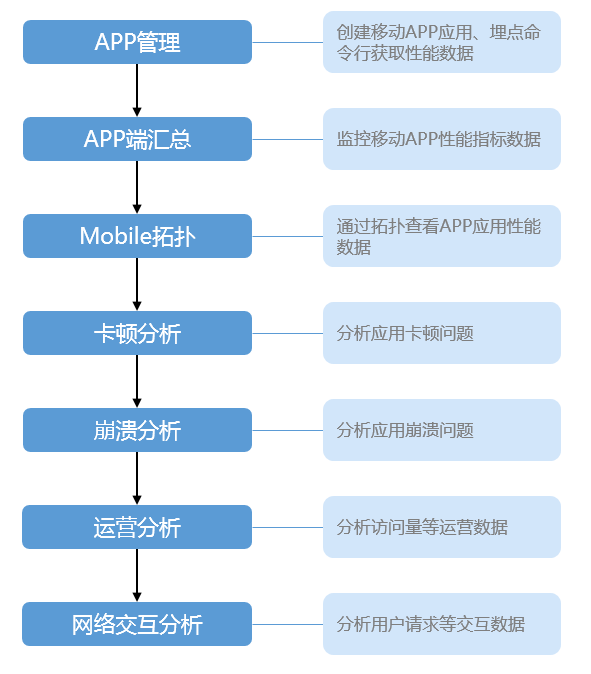
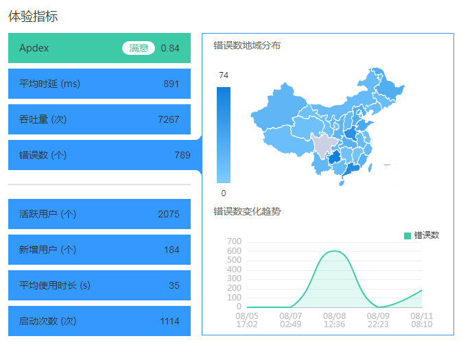
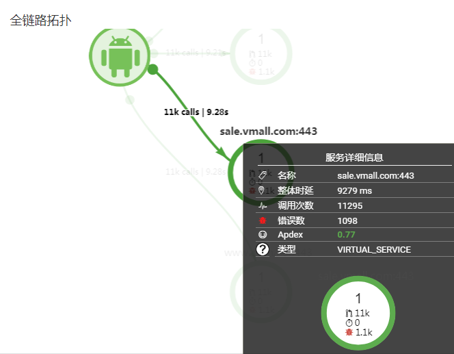
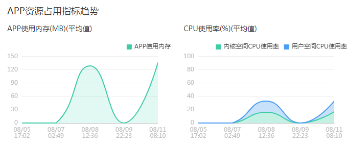
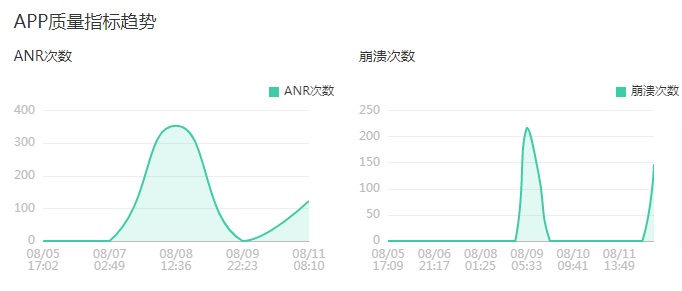
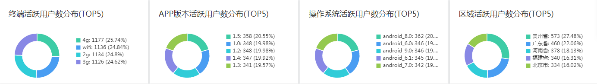

# APP端汇总

## Mobile简介

华为云应用性能管理-Mobile致力于为您提供清晰直观的移动APP性能监控数据，通过用户体验、吞吐量、错误数、崩溃、ANR（Application Not Response）等多项指标，为您展现不同维度的移动APP性能数据，助您快速定位性能瓶颈，完成移动APP性能优化。

在用户体验至上的互联网时代，移动APP的用户体验至关重要，成为移动APP是否成功的关键因素之一，然而移动APP通常安装在用户手机上，企业往往无法感知到真实的用户体验，只能依靠调研随访、用户反馈等方式收集用户意见，从而对移动APP进行优化。可想而知，这种方式并不高效，甚至并没有效果。

华为云应用性能管理Mobile端侧监控采用非侵入式埋点技术，只需简单的一个命令行即可完成业务代码埋点。使用华为云应用性能管理-Mobile您将瞬间和您在全球各地的用户建立联系，实时感知他们的用户体验。海内存知己，天涯若比邻，即使相隔千里，用户的使用体验也将即刻在您的APP汇总页面上呈现，快速发现性能瓶颈，完成性能优化，助您实现商业成功。

## Mobile流程图

## 监控指标说明

**用户体验**

华为云应用性能管理服务使用Apdex（Application Performance Index）度量用户体验，根据用户等待响应的时间将每次网络请求评估为满意、可容忍、不满意三个等级，并根据公式进行计算，量化用户体验，帮助您了解应用基本情况。

**吞吐量**

吞吐量指的是指定时间内用户进行网络请求的总次数。

**时延（TP99时延）**

TP99时延=完成99%的网络请求所需要的最短耗时。

举例：假设总请求数为100个，它们的请求耗时分别为1s、2s、3s、4s……98s、99s、100s。若要完成99%的请求，我们至少需要99s，故TP99为99s。

计算：将所有请求按照耗时从小到大排序，第（99%\*总请求数）个请求的耗时即为TP99时延。

**错误数**

错误数是指用户进行网络请求失败的次数。

**移动应用崩溃个数**

应用的崩溃个数指标图可以直观的展示您当前应用崩溃频率，未来华为移动APP会提供更多崩溃统计指标和展示崩溃详情的能力，能让您更加全面的掌握APP的崩溃问题。

**地域分布**

基于地理位置的移动应用的统计信息能够帮您直观的展示全球各地的人们使用APP的情况，为您优化移动APP提供最直观、最精准的信息。

**拓扑**

华为云移动APP性能检测提供了端到端展示应用拓扑的能力。即使您只购买了移动端的探针我们也能为您展示移动APP和所有外部应用的交互信息。如果您同时购买了移动端和云服务的探针，我们将为您展示端到端的全景应用拓扑。

## APP端汇总界面操作

-   **查看体验指标**

    包括APP的Apdex、平均时延、吞吐量、错误数等指标，同时提供各指标的地域分布图和变化趋势图。

    

-   **查看全链路拓扑**

    可查看端侧与各个服务之间的调用关系及服务详细信息。

    

-   **查看APP资源占用指标趋势**

    从APP使用内存和CPU使用率维度统计趋势图。

    

-   **查看APP质量指标趋势**

    从ANR次数和崩溃次数维度统计趋势图。

    

-   **查看TOP5用户分布数据**

    从终端、APP版本、操作系统、区域四个维度统计活跃用户数分布TOP5。

    

