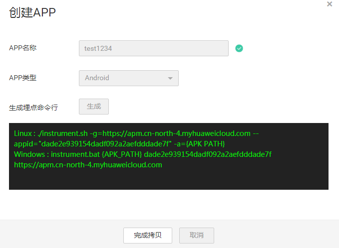
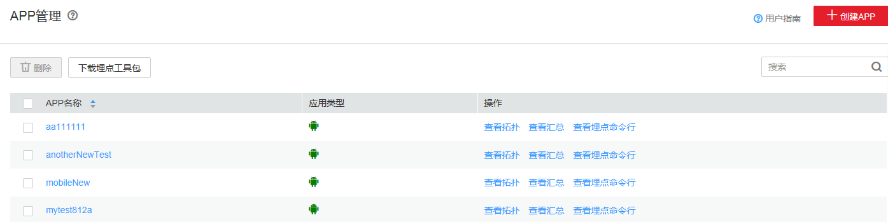
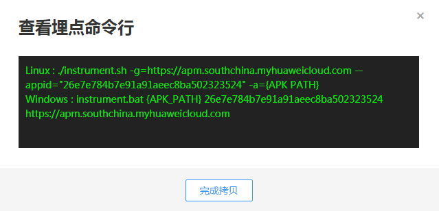

# APP管理

APP管理即创建移动APP应用。

> **说明：**   
>1.  Mobile探针需要的手机权限：  
>    权限1：android.permission.INTERNET  
>    权限2：android.permission.ACCESS\_NETWORK\_STATE  
>2.  执行埋点命令工具的环境必须安装Java1.8及以上版本，并设置了正确的JAVA\_HOME环境变量。  

## 新建移动APP应用

1.  在左侧导航栏中选择“Mobile”，展开选项卡，单击“APP管理”。
2.  单击“创建APP”，按提示输入应用名称并选择APP类型后点击“生成”，系统将生成专属您应用的埋点命令行。

    黑色背景框中会生成Windows和Linux的命令行。

    

    > **说明：**   
    >APP类型支持Android和IOS两种。  

3.  单击“完成拷贝”，完成应用创建并自动拷贝命令行到剪贴板。
4.  将拷贝的命令行粘贴到记事本文档，待埋点时使用。

## 为APP埋点

如何为APP埋点请参见[快速接入Mobile](https://support.huaweicloud.com/qs-apm/apm_00_0012.html)。

## 埋点命令行

1.  在应用创建完成后，埋点命令行就已存在于剪贴板中。若您不慎丢失命令行，或需要埋点升级的app，请在操作列单击“查看埋点命令行”。

    

2.  在“查看埋点命令行”弹框中单击“完成拷贝”重新获取埋点命令行。

    

3.  重新执行埋点过程生成新的APK文件。

    等待3分钟，移动APP的性能统计数据就会发送到Mobile后台服务器上，此时，进入已创建APP的汇总页面就可以看到APP的性能数据。同时在Mobile拓扑页面中也可以看到对应后台服务的拓扑信息，将前端展开后就可以看到Android的统计信息。

## 更多APP管理界面操作

在APP管理中，您还可以执行如[表1](#table15831736105910)操作。

**表 1**  相关操作

<table><thead align="left"><tr id="row14583153620596"><th class="cellrowborder" valign="top" width="20%" id="mcps1.2.3.1.1">
操作

</th>
<th class="cellrowborder" valign="top" width="80%" id="mcps1.2.3.1.2">
说明

</th>
</tr>
</thead>
<tbody><tr id="row1058316369591"><td class="cellrowborder" valign="top" width="20%" headers="mcps1.2.3.1.1 ">
全选或者取消全选

</td>
<td class="cellrowborder" valign="top" width="80%" headers="mcps1.2.3.1.2 ">
可通过全选APP管理表中行，通过可取消全选。

</td>
</tr>
<tr id="row019992094812"><td class="cellrowborder" valign="top" width="20%" headers="mcps1.2.3.1.1 ">
跳转到拓扑界面

</td>
<td class="cellrowborder" valign="top" width="80%" headers="mcps1.2.3.1.2 ">
在操作列单击“查看拓扑”，可跳转到Mobile拓扑界面详细查看调用过程。

</td>
</tr>
<tr id="row185831236125917"><td class="cellrowborder" valign="top" width="20%" headers="mcps1.2.3.1.1 ">
跳转到APP汇总界面

</td>
<td class="cellrowborder" valign="top" width="80%" headers="mcps1.2.3.1.2 ">
在操作列单击“查看汇总”，可跳转到APP汇总界面，查看用户体验详情。

</td>
</tr>
</tbody>
</table>

