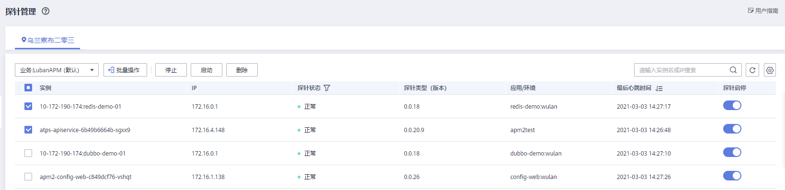

# Agent操作

## 查看Agent

1.  在左侧导航栏中选择“应用监控 \> Agent管理”。
2.  在Agent管理页查看Agent列表。

    1.  在页面左上角选择所在区域、所在业务进行过滤。
    2.  在页面右上角搜索框设置搜索条件后，单击"搜索"，查看满足搜索条件的Agent列表。

    **图 1**  查看Agent  
    

Agent状态说明详见下表。

<table><thead align="left"><tr id="row18746172282415"><th class="cellrowborder" valign="top" width="20.93%" id="mcps1.1.3.1.1">
状态

</th>
<th class="cellrowborder" valign="top" width="79.07%" id="mcps1.1.3.1.2">
说明

</th>
</tr>
</thead>
<tbody><tr id="row27462022182419"><td class="cellrowborder" valign="top" width="20.93%" headers="mcps1.1.3.1.1 ">
正常

</td>
<td class="cellrowborder" valign="top" width="79.07%" headers="mcps1.1.3.1.2 ">
该Agent运行正常。

</td>
</tr>
<tr id="row874642212247"><td class="cellrowborder" valign="top" width="20.93%" headers="mcps1.1.3.1.1 ">
离线

</td>
<td class="cellrowborder" valign="top" width="79.07%" headers="mcps1.1.3.1.2 ">
由于网络问题导致该Agent功能异常，请检查并恢复网络。

</td>
</tr>
<tr id="row47468220243"><td class="cellrowborder" valign="top" width="20.93%" headers="mcps1.1.3.1.1 ">
停止

</td>
<td class="cellrowborder" valign="top" width="79.07%" headers="mcps1.1.3.1.2 ">
该Agent被手动停止或全局停止，请联系技术人员处理。

</td>
</tr>
</tbody>
</table>

## 批量操作

1.  在左侧导航栏中选择“应用监控 \> Agent管理”。
2.  单击“批量操作”，勾选需要操作的对象，选择停止/启动/删除。
3.  在弹出的弹框单击“是”，完成对所选Agent的停止/启动/删除操作。

    **图 2**  批量操作Agent  
    

