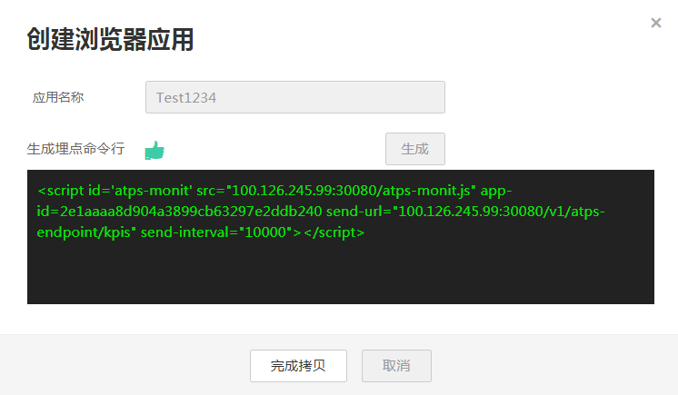
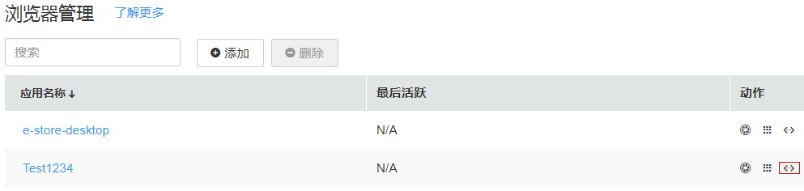

# Browser管理

Browser管理即创建浏览器应用。

## 新建浏览器应用

1.  登录[应用性能管理](https://console.huaweicloud.com/apm/)。
2.  在左侧导航栏中选择“Browser”，展开选项卡，单击“管理”。
3.  创建浏览器应用。单击“添加”，按提示输入应用名称后点击“生成”，系统将生成专属您应用的埋点命令行。

    

4.  单击“完成拷贝”，完成应用创建并自动拷贝命令行到剪贴板。

    > **注意：**   
    >若您的页面涉及跨域访问，您需要在跨域目标服务器上配置以下自定义Header：Access-Control-Allow-Methods: POST,OPTIONS,GET,PUTAccess-Control-Allow-Headers: X-Application-Id,Content-Type,X-EP-App-Id,X-App-Id,Pinpoint-TxType,Pinpoint-SrcResId,Pinpoint-TraceID,Pinpoint-pSpanID,Pinpoint-SpanID,X-Device-Id,X-Forwarded-For,X-Real-IpAccess-Control-Expose-Headers: Date,X-Dest-Resource-Id,Pinpoint-TxType,Pinpoint-SrcResId,X-App-Id,Pinpoint-CallChain,Zipkin-TraceID,Pinpoint-MonitorG,Timing-Allow-Origin  

## 嵌入命令行

1.  在应用创建完成后，埋点命令行就已存在于剪贴板中。若您不慎丢失命令行，可在列表右侧的动作列单击。

    

2.  在“查看埋点命令行”弹框中单击“完成拷贝”重新获取埋点命令行。

    

3.  将命令行粘贴在您想要监控的页面的HTML文件中**<head\>**代码块的**第一行**，然后重启应用即可。

    > **注意：**   
    >如果相比全站的监控数据您更关心单页面的监控数据，您可以为单页面创建一个应用并嵌入它的专属命令行，这样通过该应用即可查看单页面的监控数据。  

## 更多浏览器管理界面操作

在浏览器管理中，您还可以执行如下表操作。

**表 1**  相关操作

<table><thead align="left"><tr id="row14583153620596"><th class="cellrowborder" valign="top" width="20%" id="mcps1.2.3.1.1">
操作

</th>
<th class="cellrowborder" valign="top" width="80%" id="mcps1.2.3.1.2">
说明

</th>
</tr>
</thead>
<tbody><tr id="row1058316369591"><td class="cellrowborder" valign="top" width="20%" headers="mcps1.2.3.1.1 ">
全选或者取消全选

</td>
<td class="cellrowborder" valign="top" width="80%" headers="mcps1.2.3.1.2 ">
可通过全选浏览器应用管理表中行，通过可取消全选。

</td>
</tr>
<tr id="row019992094812"><td class="cellrowborder" valign="top" width="20%" headers="mcps1.2.3.1.1 ">
跳转到拓扑界面

</td>
<td class="cellrowborder" valign="top" width="80%" headers="mcps1.2.3.1.2 ">
单击列表右侧的动作列单击按钮，可跳转到Browser拓扑界面详细查看调用过程。

</td>
</tr>
<tr id="row185831236125917"><td class="cellrowborder" valign="top" width="20%" headers="mcps1.2.3.1.1 ">
跳转到浏览器汇总界面

</td>
<td class="cellrowborder" valign="top" width="80%" headers="mcps1.2.3.1.2 ">
单击列表右侧的动作列单击按钮，可跳转到浏览器汇总界面，查看用户体验详情。

</td>
</tr>
</tbody>
</table>

