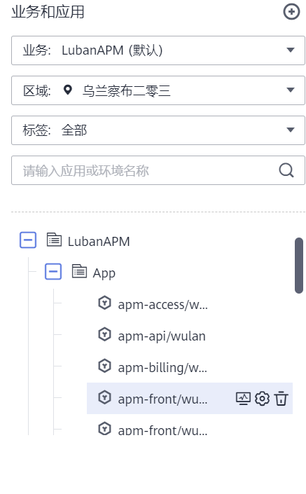

# CMDB结构树

APM会内置一个资源配置管理信息CMDB，用于组织应用结构信息以及相关配置信息，主要概念如下：

-   **企业项目**： 华为云企业项目，一个项目可以包含一个或者多个业务。
-   **业务**（**business**）： 一个业务代表一个逻辑单元，是一个全局概念，各个region都可以看到相同的业务信息，比如一个租户下面比较独立的功能模块可以定义为一个业务。业务可以跟企业项目关联，也可以不关联，关联企业项目后，按企业项目的权限进行管理，如果不关联企业项目，那么按照IAM权限进行管理。
-   **子业务**（**subBusiness**）：在一个业务下面可以创建多个子业务，主要起文件夹和管理的功能。子业务为全局概念，当前最多支持两层子业务。
-   **应用**（**appName**）：应用指一个应用程序或者微服务，为全局概念。在云服务场景下，一个应用程序可能部署在多个region，每个region形成一个环境。比如一个订单的应用，包含功能测试环境，压力测试环境，预发环境以及现网环境。
-   **环境（env）**：一个应用程序部署在多个region，形成多个环境。每个环境都有region属性，可以通过region信息可实现环境的过滤，也可以在环境上打上一个或多个标签，通过标签进行环境过滤。环境是同质实例的集合，环境名称可以为空，当为空时默认使用应用名称代表环境名称。
-   **实例**（**instanceName**）：实例是环境下的一个进程，名称由主机名+ip+实例名称组成。一个环境一般是部署在不同主机上或不同容器中，若部署在同一主机上，会通过实例名称进行区分。
-   **环境标签**（**envTag**）：环境标签是在环境上的一个属性，多个环境可能具有相同的的标签，可以通过标签对环境进行过滤。标签未来也承载公共配置能力，比如在某个标签上设置的配置，各个具有标签的环境都共享。需注意环境标签定义在业务层面，也就是说一个标签只能添加在本业务下的环境，不能跨业务进行。

下图是一个cmdb结构示例：

