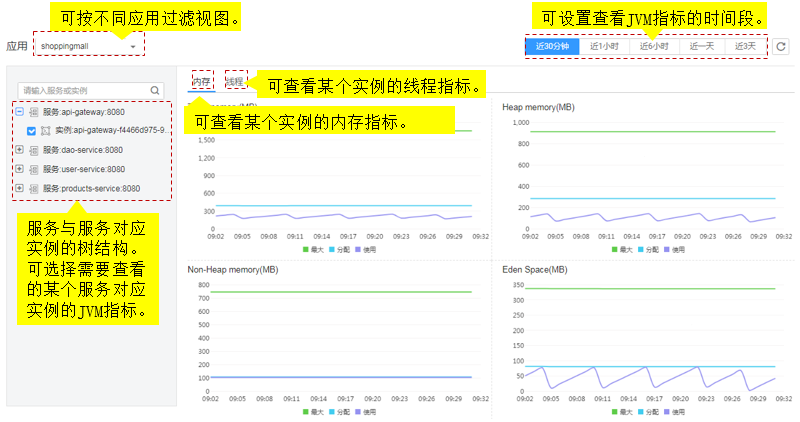
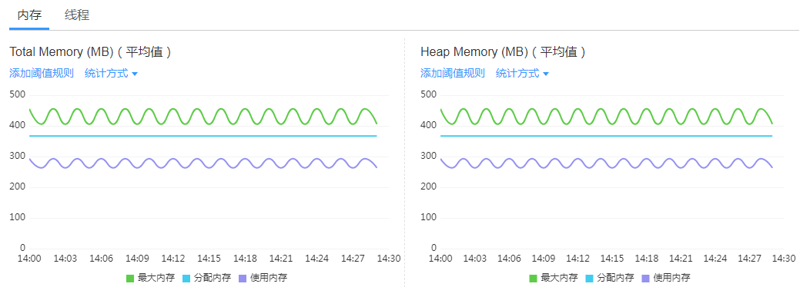
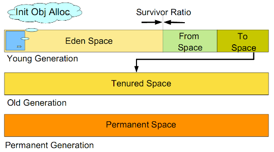
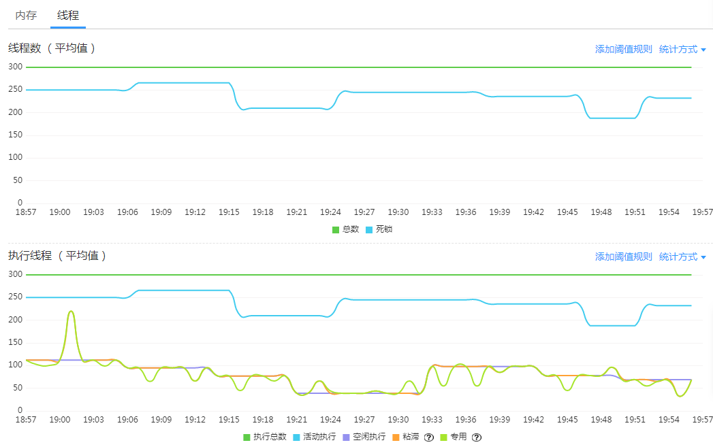

# JVM监控

JVM监控展示基于Java应用的JVM运行环境的内存和线程指标，您可以实时监控指标趋势进行性能分析。

JVM监控功能提供JVM内存和线程指标，您可以单击“内存”和“线程”两个页签，查看内存和线程指标图，快速分析定位内存泄漏、线程异常等问题。

## JVM监控界面说明

**图 1**  JVM监控界面  

## 内存指标图表

如[图2](#fig133607441526)所示，展示设置的时间段内某个实例的总内存、堆内存、非堆内存等JVM不同内存区域的最大值、分配值和使用情况的趋势，也展示近30分钟内某个实例的垃圾收集堆的GC时间和GC次数趋势。

**图 2**  内存指标图  

**JVM内存介绍**

JVM区域总体分为Heap memory（堆内存）和Non-Heap memory（非堆内存）。

-   Heap memory：堆是Java 虚拟机运行时数据区域，分配所有类实例和数组的内存。对象的堆内存由称为垃圾回收器的自动内存管理系统回收。Heap区分为Eden Space（伊甸园）、Survivor Space （幸存者区） 和Tenured Space（养老区）。
-   Non-Heap memory：Java 虚拟机管理堆之外的内存。Non-Heap区分为Code Cache （代码缓存区）、Permanent Space （永久保存区）或Meta Space（元空间）。

Java堆是垃圾收集器管理的主要区域，又称为Garbage Collectioned Heap（垃圾收集堆），GC方式包括Full GC （整个堆垃圾收集）和Minor GC（新生代垃圾收集）。

**表 1**  内存区域说明

<table><thead align="left"><tr id="row1038455912310"><th class="cellrowborder" valign="top" width="15.9%" id="mcps1.2.3.1.1">
区域名称

</th>
<th class="cellrowborder" valign="top" width="84.1%" id="mcps1.2.3.1.2">
说明

</th>
</tr>
</thead>
<tbody><tr id="row138715599316"><td class="cellrowborder" valign="top" width="15.9%" headers="mcps1.2.3.1.1 ">
Eden Space

</td>
<td class="cellrowborder" valign="top" width="84.1%" headers="mcps1.2.3.1.2 ">
用于最初从线程池分配内存给大部分对象。

</td>
</tr>
<tr id="row12391359938"><td class="cellrowborder" valign="top" width="15.9%" headers="mcps1.2.3.1.1 ">
Survivor Space

</td>
<td class="cellrowborder" valign="top" width="84.1%" headers="mcps1.2.3.1.2 ">
用于保存在Eden区内存池中经过垃圾回收后没有被回收的对象。

</td>
</tr>
<tr id="row3394659339"><td class="cellrowborder" valign="top" width="15.9%" headers="mcps1.2.3.1.1 ">
Tenured Space

</td>
<td class="cellrowborder" valign="top" width="84.1%" headers="mcps1.2.3.1.2 ">
用于保持已经在Survivor区内存池中存在了一段时间的对象。

</td>
</tr>
<tr id="row2039717591434"><td class="cellrowborder" valign="top" width="15.9%" headers="mcps1.2.3.1.1 ">
Code Cache

</td>
<td class="cellrowborder" valign="top" width="84.1%" headers="mcps1.2.3.1.2 ">
用于编译和保存本地代码的内存。

</td>
</tr>
<tr id="row3398125912319"><td class="cellrowborder" valign="top" width="15.9%" headers="mcps1.2.3.1.1 ">
Permanent Space

</td>
<td class="cellrowborder" valign="top" width="84.1%" headers="mcps1.2.3.1.2 ">
用于保存虚拟机的静态数据，例如，类和方法对象。

</td>
</tr>
<tr id="row4401559638"><td class="cellrowborder" valign="top" width="15.9%" headers="mcps1.2.3.1.1 ">
Meta Space

</td>
<td class="cellrowborder" valign="top" width="84.1%" headers="mcps1.2.3.1.2 ">
用于保存本地化内存中类的元数据。Java 8之后Meta Space替代Permanent Space。

</td>
</tr>
<tr id="row104037591238"><td class="cellrowborder" valign="top" width="15.9%" headers="mcps1.2.3.1.1 ">
Full GC

</td>
<td class="cellrowborder" valign="top" width="84.1%" headers="mcps1.2.3.1.2 ">
当内存回收之后仍无法满足内存空间分配需求时， 对整个堆空间（新生代、老年代和永久代）进行垃圾收集。

</td>
</tr>
<tr id="row540695919316"><td class="cellrowborder" valign="top" width="15.9%" headers="mcps1.2.3.1.1 ">
Minor GC

</td>
<td class="cellrowborder" valign="top" width="84.1%" headers="mcps1.2.3.1.2 ">
当分配对象遇到内存不足时，对新生代空间（Eden区和Survivor区）进行垃圾收集。

</td>
</tr>
</tbody>
</table>

JVM采用分代垃圾回收。在JVM的内存空间中把堆空间分为老年代和新生代。将大量（90%以上）创建后短期消亡的对象存储在新生代，而老年代中存放生命周期长久的实例对象。新生代空间分为Eden区和两个Survivor区。新对象首先分配在Eden区，Survivor区作为Eden区和Tenured区的缓冲，在Survivor区的对象经历若干次收集仍然存活的，就会被转移到老年区，如[图3](#fig127551130524)所示。

**图 3**  内存区域图解  

> **说明：**   
>新生代共有两个Survivor区，分别用from和to指针指代，其中to指针指向空的Survivor区。  

## 线程指标图表

如[图4](#fig6966125612535)所示，展示设置的时间段内某个实例的线程数、粘滞线程、专用线程等线程执行情况的趋势。

**图 4**  线程指标图  

**表 2**  线程说明

<table><thead align="left"><tr id="row1564575225319"><th class="cellrowborder" valign="top" width="19.33%" id="mcps1.2.3.1.1">
线程名称

</th>
<th class="cellrowborder" valign="top" width="80.67%" id="mcps1.2.3.1.2">
说明

</th>
</tr>
</thead>
<tbody><tr id="row657961514468"><td class="cellrowborder" valign="top" width="19.33%" headers="mcps1.2.3.1.1 ">
总数

</td>
<td class="cellrowborder" valign="top" width="80.67%" headers="mcps1.2.3.1.2 ">
是指总线程数，包含活动线程数和备用线程数。粘滞线程和专用线程在执行完成后变为备用线程。

</td>
</tr>
<tr id="row1257131811414"><td class="cellrowborder" valign="top" width="19.33%" headers="mcps1.2.3.1.1 ">
死锁

</td>
<td class="cellrowborder" valign="top" width="80.67%" headers="mcps1.2.3.1.2 ">
是指两个或两个以上的进程在执行过程中，由于竞争资源或彼此通信而造成的阻塞现象，导致系统处于死锁状态，此类永远在互相等待的进程称为死锁进程。

</td>
</tr>
<tr id="row16451052125313"><td class="cellrowborder" valign="top" width="19.33%" headers="mcps1.2.3.1.1 ">
粘滞线程

</td>
<td class="cellrowborder" valign="top" width="80.67%" headers="mcps1.2.3.1.2 ">
如果执行线程处理某个请求的粘滞时间超过配置的粘滞线程最长时间 ，则该线程标记为粘滞线程。

</td>
</tr>
<tr id="row20645125219535"><td class="cellrowborder" valign="top" width="19.33%" headers="mcps1.2.3.1.1 ">
专用线程

</td>
<td class="cellrowborder" valign="top" width="80.67%" headers="mcps1.2.3.1.2 ">
如果某个请求独占执行线程的时间超过正常执行时间且不超过粘滞线程最长时间，则该线程标记为专用线程。

</td>
</tr>
<tr id="row10315203111416"><td class="cellrowborder" valign="top" width="19.33%" headers="mcps1.2.3.1.1 ">
执行总数

</td>
<td class="cellrowborder" valign="top" width="80.67%" headers="mcps1.2.3.1.2 ">
是指正在执行的线程数，包含粘滞线程数、专用线程数和正常执行的线程数。

</td>
</tr>
<tr id="row123016610457"><td class="cellrowborder" valign="top" width="19.33%" headers="mcps1.2.3.1.1 ">
活动执行

</td>
<td class="cellrowborder" valign="top" width="80.67%" headers="mcps1.2.3.1.2 ">
是指活动的线程数，包含空闲的线程数和正在执行的线程数。

</td>
</tr>
<tr id="row1784551054511"><td class="cellrowborder" valign="top" width="19.33%" headers="mcps1.2.3.1.1 ">
空闲执行

</td>
<td class="cellrowborder" valign="top" width="80.67%" headers="mcps1.2.3.1.2 ">
是指处于空闲状态的线程数。 当没有任务时线程处于空闲状态，收到请求时，线程池给此请求分配一个空闲线程，任务完成后回到线程池中等待下次任务。

</td>
</tr>
</tbody>
</table>

