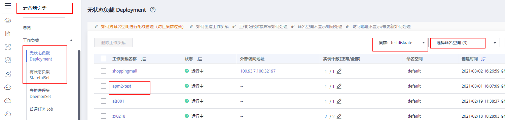

# 为部署在CCE容器中的JAVA应用安装Agent<a name="apm_07_0005"></a>

## 前提条件<a name="section8132103817447"></a>

-   确保接入APM的机器与APM服务网络连通。

    <a name="table152221920142815"></a>
    <table><thead align="left"><tr id="row222242032818"><th class="cellrowborder" valign="top" width="29.09%" id="mcps1.1.3.1.1"><p id="p1222214202282"><a name="p1222214202282"></a><a name="p1222214202282"></a>区域</p>
    </th>
    <th class="cellrowborder" valign="top" width="70.91%" id="mcps1.1.3.1.2"><p id="p142221520152820"><a name="p142221520152820"></a><a name="p142221520152820"></a>联通测试</p>
    </th>
    </tr>
    </thead>
    <tbody><tr id="row17222102010285"><td class="cellrowborder" valign="top" width="29.09%" headers="mcps1.1.3.1.1 "><p id="p1622212010280"><a name="p1622212010280"></a><a name="p1622212010280"></a>北京四</p>
    </td>
    <td class="cellrowborder" valign="top" width="70.91%" headers="mcps1.1.3.1.2 "><p id="p11237544122816"><a name="p11237544122816"></a><a name="p11237544122816"></a>telnet 100.125.12.108 41333</p>
    <p id="p13237184492820"><a name="p13237184492820"></a><a name="p13237184492820"></a>telnet 100.125.12.108 41335</p>
    </td>
    </tr>
    <tr id="row166160599210"><td class="cellrowborder" valign="top" width="29.09%" headers="mcps1.1.3.1.1 "><p id="p1361814591520"><a name="p1361814591520"></a><a name="p1361814591520"></a>上海一</p>
    </td>
    <td class="cellrowborder" valign="top" width="70.91%" headers="mcps1.1.3.1.2 "><p id="p7650628136"><a name="p7650628136"></a><a name="p7650628136"></a>telnet 100.125.4.27 41333</p>
    <p id="p1618105918210"><a name="p1618105918210"></a><a name="p1618105918210"></a>telnet 100.125.4.27 41335</p>
    </td>
    </tr>
    <tr id="row16212310141814"><td class="cellrowborder" valign="top" width="29.09%" headers="mcps1.1.3.1.1 "><p id="p424417311514"><a name="p424417311514"></a><a name="p424417311514"></a>广州</p>
    </td>
    <td class="cellrowborder" valign="top" width="70.91%" headers="mcps1.1.3.1.2 "><p id="p888695541610"><a name="p888695541610"></a><a name="p888695541610"></a>telnet 100.125.143.102 41333</p>
    <p id="p18886555111617"><a name="p18886555111617"></a><a name="p18886555111617"></a>telnet 100.125.143.102 41335</p>
    </td>
    </tr>
    <tr id="row28645123181"><td class="cellrowborder" valign="top" width="29.09%" headers="mcps1.1.3.1.1 "><p id="p063113235172"><a name="p063113235172"></a><a name="p063113235172"></a>新加坡</p>
    </td>
    <td class="cellrowborder" valign="top" width="70.91%" headers="mcps1.1.3.1.2 "><p id="p1563242351711"><a name="p1563242351711"></a><a name="p1563242351711"></a>telnet 100.125.4.25 41333</p>
    <p id="p1394484610176"><a name="p1394484610176"></a><a name="p1394484610176"></a>telnet 100.125.4.25 41335</p>
    </td>
    </tr>
    </tbody>
    </table>

-   访问[https://developer.huaweicloud.com/endpoint?APM](https://developer.huaweicloud.com/endpoint?APM)，获取所在region的endpoint。
-   选择“系统管理 \> 访问密钥”进入访问密钥页面，查看获取接入javaagent所需的AK/SK。

    


## 使用说明<a name="section1490585203712"></a>

目前只支持部署CCE的JAVA应用。在部署JAVA应用之后，手动修改部署模板的方式加载Agent，后续会实现CCE自动加载Agent功能。

## 操作步骤<a name="section2010313462448"></a>

1.  登录CCE控制台。
2.  选择“工作负载”，选择“无状态负载”或者“有状态负载”。
3.  在对应界面列表中可通过右上角过滤框筛选，找到要部署Agent的JAVA应用。

    

4.  单击目标应用的名称，进入应用详情页面。

1.  在应用详情页面，选择“工作负载运维”页签。
2.  在“性能管理配置”卡片查看“JAVA探针”是否被勾选，如图[图1 查看JAVA探针](#fig32632311686)所示。

    **图 1**  查看JAVA探针<a name="fig32632311686"></a>  
    

    -   若“JAVA探针”已被勾选，需去掉勾选，并重启实例。具体请执行[7](#li77091261911)。
    -   若“JAVA探针”未被勾选，则执行[8](#li165532037104713)。


1.  <a name="li77091261911"></a>单击“性能管理配置”卡片下的“编辑”，去掉勾选，单击“重启实例”，在提示弹框中单击“我知道了”。完成重启实例，此时APM1.0探针已被卸载。

    

    


1.  <a name="li165532037104713"></a>在应用详情页面，单击“编辑YAML”，单击“下载”，将yaml文件下载到本地。

    

2.  master-address参考示例，编辑yaml文件，其中apm2的接入地址\{master-address\}请参见[表2](Agent下载地址和接入地址master-address配置.md#table1193774063913)。

    ```
    spec:
      replicas: 1
      selector:
        matchLabels:
          app: apm2-demo
          version: v1
      template:
        metadata:
          creationTimestamp: null
          labels:
            app: apm2-demo
            version: v1
          annotations:
            metrics.alpha.kubernetes.io/custom-endpoints: '[{"api":"","path":"","port":"","names":""}]'
        spec:
          #1 添加name为paas-apm2的volumes（volumes和containers同级）
          volumes:
            - name: paas-apm2
              emptyDir: {}
          #######################添加volumes结束######################
          #2 添加initContainers
          initContainers:
            - name: init-javaagent
              # {region-name}为region名，比如上海一为 cn-east-3
              # {master-address}为apm2的接入地址，比如上海一为 https://100.125.4.27:41333
              # {app-name}为应用名称
              # {access-key}和{access-value}，请到apm2的"系统管理"-"访问秘钥"页获取
              # {business}请到apm2的"应用监控"-"指标"页创建
              # {sub-business}和{env}可选
              image: 'swr.{region-name}.myhuaweicloud.com/op_svc_apm/javaagent:latest'
              command:
                - /bin/sh
                - '-c'
                - 'cd /paas-apm2/javaagent/apm-javaagent; /bin/sh init-config.sh -master_address {master-address} -app_name {app-name} -access_key {access-key} -access_value {access-value} -business {business} -sub_business {sub-business} -env {env}'
              resources:
                limits:
                  cpu: 250m
                  memory: 250Mi
                requests:
                  cpu: 250m
                  memory: 250Mi
              volumeMounts:
                - name: paas-apm2
                  mountPath: /var/init/javaagent
              terminationMessagePath: /dev/termination-log
              terminationMessagePolicy: File
              imagePullPolicy: Always
          ########################添加initContainers结束#####################
          containers:
            - name: container-1
              image: 'swr.cn-east-2.myhuaweicloud.com/apmdemo/single-shoppingmall:v1'
              env:
                - name: PAAS_APP_NAME
                  value: apm2-demo
                - name: PAAS_NAMESPACE
                  value: default
                - name: PAAS_PROJECT_ID
                  value: 05e14a7f79000f842f09c017ff795bd1
                #3 在containers的env中添加 JAVA_TOOL_OPTIONS 环境变量
                - name: JAVA_TOOL_OPTIONS
                  value: '-javaagent:/paas-apm2/javaagent/apm-javaagent/apm-javaagent.jar'
                ########################添加JAVA_TOOL_OPTIONS结束#####################
              resources: {}
              #4 在containers的volumeMounts中，添加name为paas-apm2的配置
              volumeMounts:
                - name: paas-apm2
                  mountPath: /paas-apm2/javaagent/
              #######################添加volumeMounts结束######################
              terminationMessagePath: /dev/termination-log
              terminationMessagePolicy: File
              imagePullPolicy: IfNotPresent
    
    ```

3.  更新应用模板。
    1.  复制修改后的yaml文件内容。
    2.  修改YAML，用复制的内容覆盖原来的YAML内容。
    3.  单击“修改”，在提示弹框中单击“是”。

4.  服务重新启动完成后，Agent的加载完成，重新加载后的状态为“运行中”，如下图所示。

    


