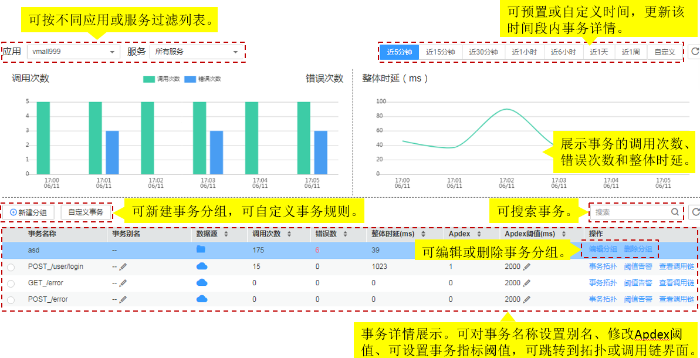
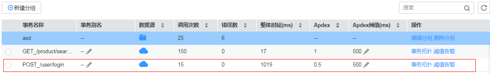

# 事务列表

在执行一个事务时，可能需要服务间多次调用来完成该事务，任何一次慢调用或错误调用都会导致系统响应较慢。在日常运维中，可通过对这些响应较慢的事务进行分析，从而定位、解决应用问题，以提升服务的用户体验。

## 事务界面操作说明

[更多操作详情请观看视频“应用性能管理操作——事务”](https://support.huaweicloud.com/apm_video/index.html)

> **说明：**   
>事务界面图中的“启用事务洞察”开关 ，仅对华北区域可见。  

## 使用事务分析问题

以某事务极慢为例。

1.  在事务界面中的事务列表中选择极慢的事务。

    

2.  单击动作列的查看拓扑结构，在拓扑界面中查看实例具体情况。
3.  右键单击极慢的实例，选择“调用链搜索”，跳转到调用链页面，通过参数、返回值、耗时等进一步定位问题。

