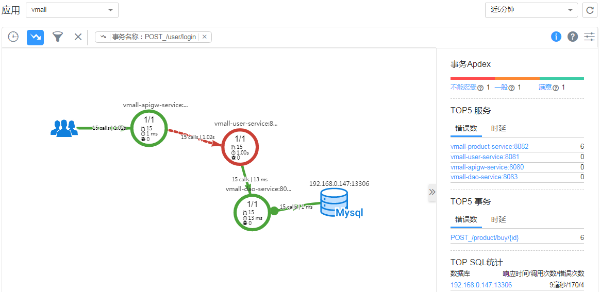
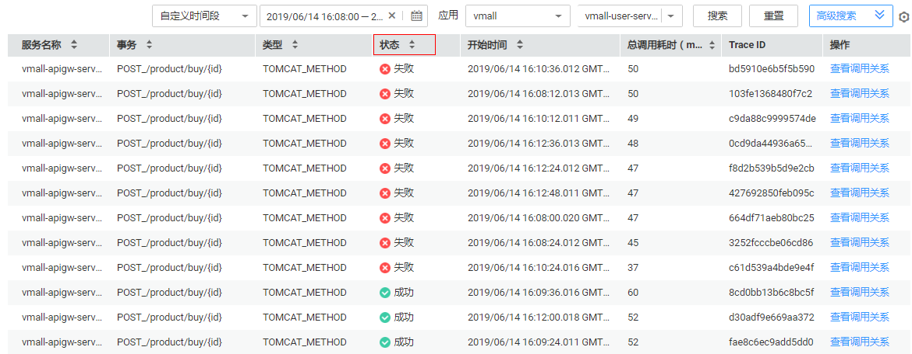
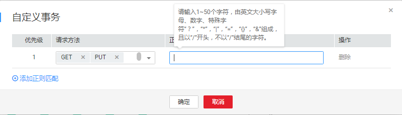

# 事务列表

事务表示一个HTTP请求，是从“用户请求 \> webserver \> DB \> webserver \> 用户请求”的完整过程。现实生活中，事务即一次任务，用户使用应用完成一项任务，比如电商应用程序中一次商品查询就是一个事务，一次支付也是一个事务。

在执行一个事务时，可能需要服务间多次调用来完成该事务，任何一次慢调用或错误调用都会导致系统响应较慢。在日常运维中，可通过对这些响应较慢的事务进行分析，从而定位、解决应用问题，以提升服务的用户体验。

## 事务界面操作说明

> **说明：**   
>事务界面图中的“事务洞察”开关 ，仅对华北区域可见。  

1.  在事务界面，可以展示设置时间内应用的事务详情。
    -   展示应用中事务的调用次数、错误次数分布情况。
    -   展示应用中事务的整体时延分布情况。

2.  在事务界面，单击“新增分组”，勾选事务项，可以将已选择的事务项移至新组，命名分组名称。
3.  在事务界面，单击“事务拓扑”，可以跳转到拓扑界面查看该事务的拓扑详情。
4.  在事务界面，单击“查看调用链”，可以跳转到调用链界面查看该事务的调用链数据。

## 使用事务分析问题

以某事务极慢为例。

1.  在事务列表中选择事务组中极慢的事务。
2.  单击操作列中“事务拓扑”查看该事务的全链路拓扑结构，在拓扑界面中查看实例具体情况。

    

3.  右键单击极慢的实例，选择“调用链搜索”，跳转到调用链页面，通过参数、调用耗时等进一步定位问题。

    

## 自定义事务

为了更精准定义事务，精准采集事务相关的调用链数据，您可以利用URI模板自定义事务，将多个请求分类放至不同的事务中。当采集器接收到请求时，优先计算自定义事务。

1.  在事务界面，单击“自定义事务”。事务是由请求方法和正则表达式组成的，事务格式为\{Request Method\}\_/\{pattern\}，例如：请求方法为GET、POST，正则表达式为 /\{name\}，则事务为GET,POST\_/\{name\}。

    

2.  选择“请求方法”。请求方法是一个或多个请求的方法名，包括GET、PUT、DELETE、POST、HEAD、CONNECT、OPTIONS、PATCH、TRACE、ALL，其中ALL表示可以匹配所有的请求方法。
3.  在“正则表达式”文本框中，输入事务规则，单击“确定”，自定义事务规则保存成功。

    正则表达式采用Spring MVC框架的[URI模板](https://docs.spring.io/spring/docs/current/spring-framework-reference/web.html#mvc-ann-requestmapping-uri-templates)匹配方式，例如：@RequestMapping\(path="/owners/\{ownerId\}/pets/\{petId\}", method=RequestMethod.GET\)，其中ownerId、petId为变量。

    如果您需要添加多条自定义事务规则，请单击“添加正则匹配”。

    > **说明：**   
    >-   事务规则只能由英文大小写字母、数字、特殊字符“？”“\*”“|”“=”“\{\}”“&”组成，且以“/”开头，不以“/”结尾，长度限制为1\~50个字符。  
    >-   “？”“\*”支持模糊匹配，“？”可以匹配一个字符，“\*”可以匹配一个URI中两个“/”中间的0到n个字符，“\*\*”可以无限匹配字符。例如：输入/first/\*，可以匹配/first/test，不能匹配/first/test/test，输入/first/\*\*，可以匹配/first/test、/first/test/test。  

