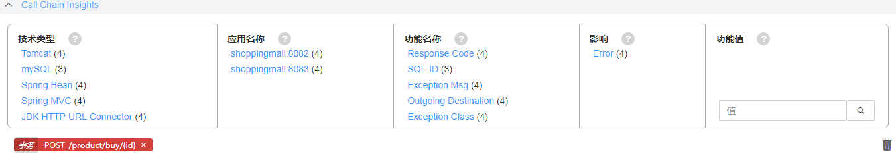
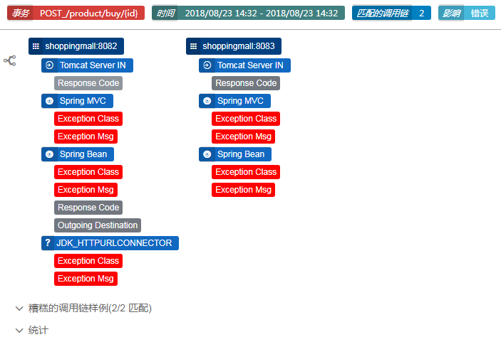
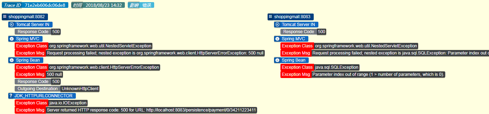
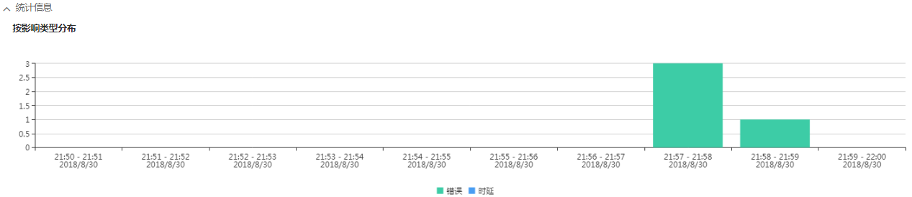
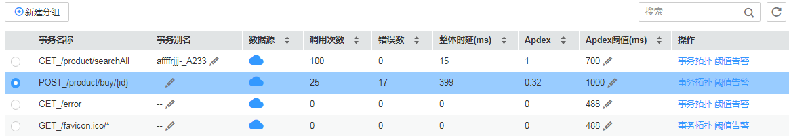
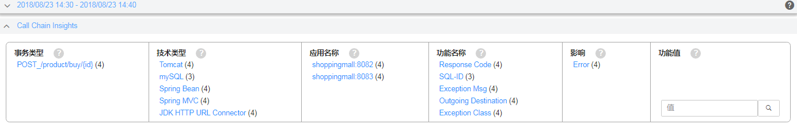
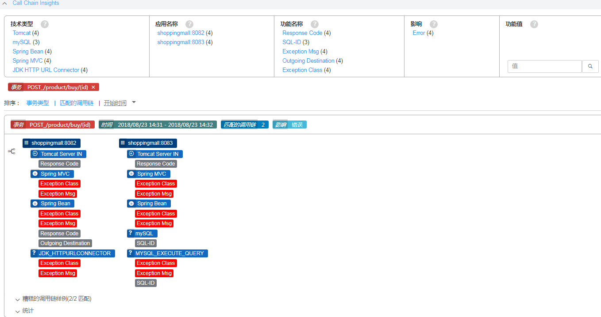
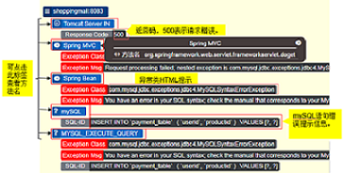

# 事务洞察

该章节功能仅对华北区域生效。

事务洞察使用调用链数据进行大数据聚类统计来生成异常类型，在启用事务洞察功能后，调用链按照100%采样率采样，以保证有足够的样例数据。

调用链数据分为两类：好和坏，导致错误或高时延的调用链属于“坏”调用链，结束时延达到“满意”阈值条件的调用链属于“好”调用链。APM系统会学习“好调用链”和“坏调用链”的特征，以找出“坏调用链”的特征。APM将“好调用链”的属性与“坏调用链”的属性进行比较，通过其显著的差异来寻找问题的原因。

您在运维过程中可以对自己业务中关键的事务开启事务洞察功能，通过得到的异常类型，更好更快的定位、解决问题，提升用户体验。

> **说明：**   
>-   目前，APM支持两种调用类型的洞察：高时延调用、错误调用。  
>    高时延调用：时延取决于事务Apdex阈值，高时延调用即超过4 \* Apdex阈值的时延调用。例如，如果Apdex阈值 =100 ms，延迟时间\> 400ms，则为高时延调用。  
>-   创建异常类型的条件：10分钟内至少有100个正常请求，同时至少有2个异常请求，则将创建异常类型。  
>-   不支持SQL语句的解析，即只能定位到SQL语句不做进一步分析。  

## 事务洞察界面介绍

1、周热力图

周热力图由不同时间段的事务洞察的时间窗组成，每10分钟汇总成一个时间窗，一个时间窗可以包含多个事务类型的异常类型。所有属于给定事务类型和匹配特征模板的异常类型，进一步聚合为一个异常类型。每个时间窗包含每10分钟内所有事务的异常信息，时间窗显示有不同的颜色（黄-\>橙-\>红逐渐过渡），颜色越接近红色表示此10分钟异常类型越多，连续着色的时间窗可能表明问题是重复发生的。每个时间窗上都有提示信息显示该时间窗包含的异常类型详情，便于查看您开启的关键事务的状态。

周热力图支持选择多个时间窗，单击右方的“X”，可清除热力图选项。

2、洞察筛选表

筛选为查询提供了一种快速简便的方法，在洞察筛选表中展示了该时间窗的所有事务洞察信息的关键词汇总并根据其特性的不同做了分类，同一类别的筛选是互斥的（同组内关键词只能单选），不同组的筛选是相容的（不同组间关键词可多选）。每个筛选关键词旁边有一个数字，表示包含关键词的异常类型数量。

您可以根据自身的需求筛选出包含所需特性的所有异常类型，每筛选一次，筛选表中关键词的范围就会缩小。您所筛选的关键词将会在表格下方显示，如果您想要取消某个关键词的筛选，只需单击其“X”标记即可。

3、洞察卡片描述的是由坏调用链分析出的特征模板。

洞察卡片由三部分组成：

1.  异常类型描述：坏调用链引起的特征模板。
2.  异常调用链的样例：样例对应的详细信息。
3.  统计信息：所选时间范围内的异常类型分布。

同一事务不同的异常原因可能产生多个洞察卡片，洞察卡片支持以事务类型、匹配调用链、开始时间进行排序，便于查看。

每张洞察卡片的首部有4个标识：事务类型（一个异常类型关联一个事务类型）、活跃时间范围（在选择的整个时间范围内，洞察活跃的时间范围）、匹配的调用链（与异常类型的特征模板相匹配的坏调用链数）、影响（可能的值有时延和错误两种 ）。

-   出现在同一个调用链中的差异组成一组，成为一个特征模板，用于问题识别。

    

-   上述特征模板中仅仅是做一个展示，可展开“异常调用链的样例”查看样例中具体信息。

    在界面展示的样例个数是默认从洞察范围的开始、中间和结束处选择“匹配的调用链”的3个样例。每个样例描述了完全匹配异常类型特征模板的坏调用链，这些样例显示了异常调用链的所在服务、错误码等信息。如果您想要获取更多调用过程的问题，可单击“Trace ID”查看调用链。

    

-   统计信息是按照事务洞察的影响类型分布的，影响类型有时延和错误两种。每一个柱形统计了所选时间范围内一分钟的影响类型的数量。

    

## 使用事务洞察分析问题

例如当前我已有应用，名称为**e-store**，它是一个电商应用，有一个事务是购买事务，名称为POST\_/product/buy/\{id\}。

下面以开启应用e-store中的事务购买事务POST\_/product/buy/\{id\}为例，开始事务洞察分析性能问题的原因。

1.  登录[应用性能管理](https://console.huaweicloud.com/apm/)。
2.  在导航栏左侧单击“事务列表”进入事务界面，在事务列表中选择事务名称为POST\_/product/buy/\{id\}并点击“启用事务洞察”。

    事务洞察特性按事务类型配置，默认关闭。

    

3.  在导航栏左侧单击“事务洞察”进入事务洞察界面，在周热力图中选择一个样例数最多的时间窗（9个样例），单击进入“调用链洞察”页面，可查看更多的信息，同时周热力图将会收起，呈现出您所选时间窗的时间范围。

    

4.  此时，在调用链洞察页面的筛选表格中是已所选时间窗包含的所有异常类型特性（关键词），并按照特性的功能做了分类。

    

    接下来单击事务类型组中的关键词POST\_/product/buy/\{id\}\(4\)筛选出包含该关键词的所有异常类型。

    如下图，完成了关键词筛选，筛选表中的范围变小了，过滤出了4个洞察卡片都显示事务类型为POST\_/product/buy/\{id\}的信息。在洞察卡片的模式中显示了该事务性能问题所在位置，即服务为8083的mysql语句存在问题。

    

5.  单击“异常调用链的样例”，可查看更多信息以找出错误语句。

    例如，从服务为8083的信息可以看到返回值为500（请求错误），有异常的HTML信息，通过这些信息可以定位出错误请求位置为mySQL语句。

    

6.  （可选）如果想要查看该调用链的更多问题，可单击“Trace ID”，跳转到调用链页面，通过参数、返回值、耗时等进一步定位问题。

## 更多事务洞察操作

开启事务洞察功能后，您还可以执行如下表操作。

**表 1**  相关操作

<table><thead align="left"><tr id="row14583153620596"><th class="cellrowborder" valign="top" width="20%" id="mcps1.2.3.1.1">
操作

</th>
<th class="cellrowborder" valign="top" width="80%" id="mcps1.2.3.1.2">
说明

</th>
</tr>
</thead>
<tbody><tr id="row1058316369591"><td class="cellrowborder" valign="top" width="20%" headers="mcps1.2.3.1.1 ">
批量删除过滤项

</td>
<td class="cellrowborder" valign="top" width="80%" headers="mcps1.2.3.1.2 ">
可通过筛选表下方的，批量删除您选择过的筛选关键词。

</td>
</tr>
<tr id="row019992094812"><td class="cellrowborder" valign="top" width="20%" headers="mcps1.2.3.1.1 ">
快速滚动上下键

</td>
<td class="cellrowborder" valign="top" width="80%" headers="mcps1.2.3.1.2 ">
在事务洞察页面右侧有或快捷键，可快速页面首端或页面尾端。

</td>
</tr>
<tr id="row185831236125917"><td class="cellrowborder" valign="top" width="20%" headers="mcps1.2.3.1.1 ">
设置洞察信息

</td>
<td class="cellrowborder" valign="top" width="80%" headers="mcps1.2.3.1.2 ">
单击屏幕中间右侧的页面设置，可修改默认的样例数量和设置洞察卡片的背景色。

</td>
</tr>
</tbody>
</table>

