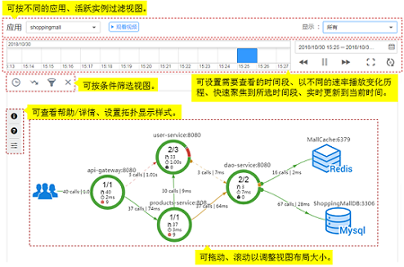

# 全链路拓扑

全链路拓扑图中，每个圆圈代表一个服务，圆圈上每个分区代表一个实例，每个箭头代表一个调用关系。APM支持跨应用调用，即拓扑图可展示不同应用服务间的调用关系，所以每个圆圈也能代表一个应用。当圆圈代表一个应用时，可在圆圈上单击右键，再单击“查看应用”跳转到关联的应用拓扑界面。

圆圈上的不同颜色代表该实例的健康程度。颜色由[Apdex](http://support.huaweicloud.com/productdesc-apm/apm_06_0002.html)值决定。Apdex值越接近 1，表示应用越健康。

## 拓扑界面操作说明

[更多操作详情请观看视频“应用性能管理——拓扑”](https://support.huaweicloud.com/apm_video/index.html)

1.  拓扑图例说明见[表1](#zh-cn_topic_0089436418_zh-cn_topic_0082166143_table17539546194139)

    **表 1**  拓扑图例说明

    
    <table><thead align="left"><tr id="zh-cn_topic_0089436418_zh-cn_topic_0082166143_row62556908194139"><th class="cellrowborder" valign="top" width="15.1%" id="mcps1.2.4.1.1">
颜色

    </th>
    <th class="cellrowborder" valign="top" width="51.38%" id="mcps1.2.4.1.2">
实例

    </th>
    <th class="cellrowborder" valign="top" width="33.52%" id="mcps1.2.4.1.3">
调用

    </th>
    </tr>
    </thead>
    <tbody><tr id="zh-cn_topic_0089436418_zh-cn_topic_0082166143_row36791289194139"><td class="cellrowborder" valign="top" width="15.1%" headers="mcps1.2.4.1.1 ">
绿色

    </td>
    <td class="cellrowborder" valign="top" width="51.38%" headers="mcps1.2.4.1.2 ">
0.75 ≤ Apdex ≤ 1

    
表示实例被调用时响应很快。

    </td>
    <td class="cellrowborder" valign="top" width="33.52%" headers="mcps1.2.4.1.3 ">
0.75 ≤ Apdex ≤ 1

    
表示响应很快。

    </td>
    </tr>
    <tr id="zh-cn_topic_0089436418_zh-cn_topic_0082166143_row10390693194139"><td class="cellrowborder" valign="top" width="15.1%" headers="mcps1.2.4.1.1 ">
黄色

    </td>
    <td class="cellrowborder" valign="top" width="51.38%" headers="mcps1.2.4.1.2 ">
0.3 ≤ Apdex &lt; 0.75

    
表示实例被调用时响应较慢。

    </td>
    <td class="cellrowborder" valign="top" width="33.52%" headers="mcps1.2.4.1.3 ">
0.3 ≤ Apdex &lt; 0.75

    
表示响应较慢。

    </td>
    </tr>
    <tr id="zh-cn_topic_0089436418_zh-cn_topic_0082166143_row22136902194139"><td class="cellrowborder" valign="top" width="15.1%" headers="mcps1.2.4.1.1 ">
红色

    </td>
    <td class="cellrowborder" valign="top" width="51.38%" headers="mcps1.2.4.1.2 ">
0 ≤ Apdex &lt; 0.3

    
表示实例被调用时响应极慢。

    </td>
    <td class="cellrowborder" valign="top" width="33.52%" headers="mcps1.2.4.1.3 ">
0 ≤ Apdex &lt; 0.3

    
表示响应极慢。

    </td>
    </tr>
    <tr id="zh-cn_topic_0089436418_zh-cn_topic_0082166143_row49564573194139"><td class="cellrowborder" valign="top" width="15.1%" headers="mcps1.2.4.1.1 ">
灰色

    </td>
    <td class="cellrowborder" valign="top" width="51.38%" headers="mcps1.2.4.1.2 ">
实例未被调用。

    </td>
    <td class="cellrowborder" valign="top" width="33.52%" headers="mcps1.2.4.1.3 ">
-

    </td>
    </tr>
    <tr id="zh-cn_topic_0089436418_zh-cn_topic_0082166143_row66013680194139"><td class="cellrowborder" valign="top" width="15.1%" headers="mcps1.2.4.1.1 ">
黑色

    </td>
    <td class="cellrowborder" valign="top" width="51.38%" headers="mcps1.2.4.1.2 ">
实例已被删除。

    </td>
    <td class="cellrowborder" valign="top" width="33.52%" headers="mcps1.2.4.1.3 ">
-

    </td>
    </tr>
    </tbody>
    </table>

2.  在拓扑界面中，该拓扑配置对事务界面的拓扑图也生效。例如如果此处关闭了缩放视图，那么在事务界面中，事务拓扑图也不能进行缩放。

    

## 通过拓扑快速定位问题

以定位实例缓慢问题为例。

1.  在拓扑界面中，设置右上角的快照时间，将时间调整到问题发生的时间段。
2.  查看拓扑图中执行时间较大即标红的实例，示例如[图1](#zh-cn_topic_0089436418_fig15508102063518)。

    **图 1**  问题实例示意图  
    

3.  （可选）对于多个实例的服务，可右键单击实例，选择“展开”查看实例级别的调用关系，初步确认问题实例。
4.  选择“调用链搜索”，跳转到调用链页面，通过参数、返回值、耗时等进一步定位问题。

## 精准设置事务Apdex阈值

不同事务的响应时间不同，APM支持对不同事务设置不同的Apdex阈值。例如，登录操作超过50ms可认为响应很慢、查询事务超过10ms可认为响应很慢，这种情况下需要对操作和查询事务分别设置Apdex阈值。

1.  在拓扑界面中，将鼠标放在圈图上，右击并选择“修改阈值”。
2.  修改事务Apdex阈值，并单击“确定”。

    

