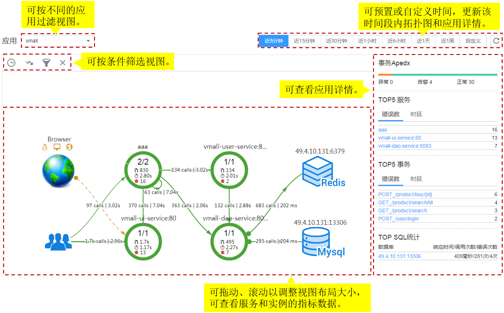
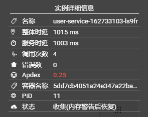
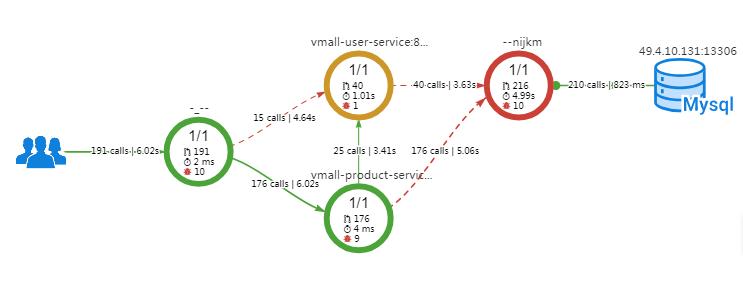
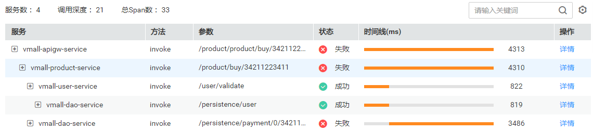
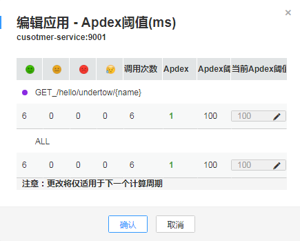

# 全链路拓扑

拓扑是对应用间调用关系和依赖关系的可视化展示。全链路拓扑图中，每个圆圈代表一个服务，圆圈上每个分区代表一个实例，每个箭头代表一个调用关系。APM支持跨应用调用，即拓扑图可展示不同应用的服务间调用关系，可在圆圈上单击右键，再单击“查看应用”跳转到关联的应用拓扑界面。

圆圈上的不同颜色代表该实例的健康程度。颜色由[Apdex](http://support.huaweicloud.com/productdesc-apm/apm_06_0002.html)值决定。Apdex值越接近1，表示应用越健康。

## 拓扑界面操作说明

1.  拓扑图例说明见[表1](#tf620eeefc075429b9c1251eb5f583344)

    **表 1**  拓扑图例说明

    
    <table><thead align="left"><tr id="r826dbedecbb145069b30296b1990b34e"><th class="cellrowborder" valign="top" width="15.1%" id="mcps1.2.4.1.1">
颜色

    </th>
    <th class="cellrowborder" valign="top" width="51.38%" id="mcps1.2.4.1.2">
实例

    </th>
    <th class="cellrowborder" valign="top" width="33.52%" id="mcps1.2.4.1.3">
调用

    </th>
    </tr>
    </thead>
    <tbody><tr id="r67dee38df3594c5e8733411417a9daff"><td class="cellrowborder" valign="top" width="15.1%" headers="mcps1.2.4.1.1 ">
绿色

    </td>
    <td class="cellrowborder" valign="top" width="51.38%" headers="mcps1.2.4.1.2 ">
0.75 ≤ Apdex ≤ 1

    
表示实例被调用时响应很快。

    </td>
    <td class="cellrowborder" valign="top" width="33.52%" headers="mcps1.2.4.1.3 ">
0.75 ≤ Apdex ≤ 1

    
表示响应很快。

    </td>
    </tr>
    <tr id="r7778bfedb14b4d07834e3df1d590c31b"><td class="cellrowborder" valign="top" width="15.1%" headers="mcps1.2.4.1.1 ">
黄色

    </td>
    <td class="cellrowborder" valign="top" width="51.38%" headers="mcps1.2.4.1.2 ">
0.3 ≤ Apdex &lt; 0.75

    
表示实例被调用时响应较慢。

    </td>
    <td class="cellrowborder" valign="top" width="33.52%" headers="mcps1.2.4.1.3 ">
0.3 ≤ Apdex &lt; 0.75

    
表示响应较慢。

    </td>
    </tr>
    <tr id="rdfa8c7fd96f54c3ea0855c17cf3f09bb"><td class="cellrowborder" valign="top" width="15.1%" headers="mcps1.2.4.1.1 ">
红色

    </td>
    <td class="cellrowborder" valign="top" width="51.38%" headers="mcps1.2.4.1.2 ">
0 ≤ Apdex &lt; 0.3

    
表示实例被调用时响应极慢。

    </td>
    <td class="cellrowborder" valign="top" width="33.52%" headers="mcps1.2.4.1.3 ">
0 ≤ Apdex &lt; 0.3

    
表示响应极慢。

    </td>
    </tr>
    <tr id="r751d0ffa17cb42fc95f24ea5f77a9689"><td class="cellrowborder" valign="top" width="15.1%" headers="mcps1.2.4.1.1 ">
灰色

    </td>
    <td class="cellrowborder" valign="top" width="51.38%" headers="mcps1.2.4.1.2 ">
实例未被调用。

    </td>
    <td class="cellrowborder" valign="top" width="33.52%" headers="mcps1.2.4.1.3 ">
-

    </td>
    </tr>
    <tr id="r9a858f9fd94a4234a84e821cce85d71a"><td class="cellrowborder" valign="top" width="15.1%" headers="mcps1.2.4.1.1 ">
黑色

    </td>
    <td class="cellrowborder" valign="top" width="51.38%" headers="mcps1.2.4.1.2 ">
实例已被删除。

    </td>
    <td class="cellrowborder" valign="top" width="33.52%" headers="mcps1.2.4.1.3 ">
-

    </td>
    </tr>
    </tbody>
    </table>

2.  在拓扑界面右侧，可以展示设置时间内应用的拓扑详情。
    -   展示应用下所有事务Apdex状态分布情况。
    -   统计错误数和时延数排名TOP5的服务。
    -   统计错误数和时延数排名TOP5的事务。
    -   统计响应时间、调用次数和错误次数排名TOP5的SQL语句。

3.  在拓扑图中，单击圆圈选中服务，可以查看该服务的指标数据，包括SLA（Service-Level Agreement）、服务基础指标和事务详情。
4.  在拓扑图中，单击圆圈上的分区选中实例，可以查看该实例的指标数据，包括实例基础指标、jvm指标、节点指标和事务详情。

## 通过拓扑快速定位问题

以定位实例缓慢问题为例。

1.  在拓扑界面的右上角设置问题发生的时间段。
2.  查看拓扑图中执行时间较大即标红的实例。

    

3.  （可选）对于多个实例的服务，可右键单击服务，选择“展开”查看实例级别的调用关系，初步确认问题实例。

    

4.  选择“调用链搜索”，跳转到调用链页面，通过参数、返回值、耗时等进一步定位问题。

    

## 精准设置事务Apdex阈值

不同事务的响应时间不同，APM支持对不同事务设置不同的Apdex阈值。例如，登录操作超过50ms可认为响应很慢、查询事务超过10ms可认为响应很慢，这种情况下需要对操作和查询事务分别设置Apdex阈值。

1.  在拓扑界面中，将鼠标放在圈图上，右击并选择“修改阈值”。
2.  修改事务Apdex阈值，并单击“确定”。

    

