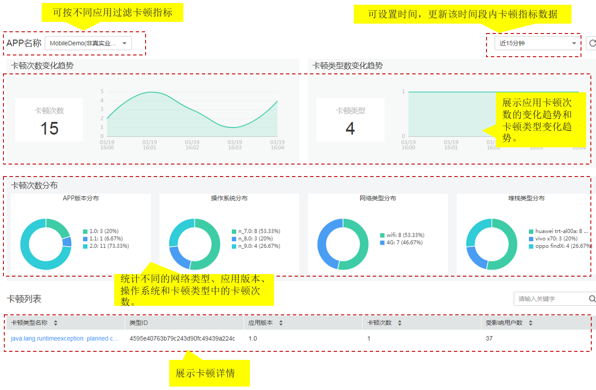

# 卡顿分析

该功能仅对华北-北京一区域生效。

卡顿是指应用无响应，当应用在特定的时间内没有完成任务时，系统弹出窗口询问用户选择“强制关闭”（结束发生卡顿的应用进程）或者“等待”（等待系统恢复此应用进程）。APP的卡顿严重影响用户体验，开发者竭力避免APP的卡顿，但是很难复现所有的，部分卡顿问题会遗留到用户手机上。当出现卡顿时，APM端侧探针通过非侵入式埋点技术采集应用的设备参数和异常信息，并将卡顿信息展示在卡顿分析页面中。华为云应用性能管理Mobile为您提供卡顿统计指标和展示卡顿详情的能力，从而快速定位解决APP性能问题，提升用户体验。

## 卡顿分析界面说明

## 卡顿问题定位

当出现卡顿时，先查看日志（卡顿时间、进程、卡顿类型、CPU使用情况），从追踪文件（trace.txt文件）查看调用的堆栈信息，再查看代码，定位产生卡顿的具体原因。

卡顿的主要原因：

-   网络因素：网速欠佳，无法达到应用所需的快速响应时间导致卡顿；不同网络类型的切换也可能会影响APP的稳定性。

-   CPU满负荷：如果CPU使用量接近100%，说明当前设备很忙，主线程可能被卡住导致卡顿。

-   I/O阻塞：如果当前系统中主线程正在进行的I/O（Input/Output）操作被阻塞可能导致卡顿。

1.  选择“Mobile \> 卡顿分析”，进入“卡顿分析”界面。
2.  在“卡顿分析”页面中，选择应用名称，设置查询时间后，数据自动刷新。
3.  查看“卡顿次数”，展示设置时间段内应用的卡顿次数变化趋势。
4.  查看“卡顿类型”，展示设置时间段内应用的卡顿类型变化趋势。
5.  查看“卡顿次数分布”，按照不同的网络类型、应用版本、操作系统和卡顿类型统计卡顿次数，识别频繁出现卡顿的网络类型、应用版本、操作系统和卡顿类型，为分析应用无响应原因提供参考依据。
6.  查看“卡顿列表”，展示卡顿名称、卡顿类型、应用版本和卡顿次数。
7.  单击“卡顿类型名称”，进入详情界面，查看卡顿详情。
    -   展示卡顿名称、卡顿类型、发生卡顿的总次数和卡顿发现的最近时间。
    -   查看应用无响应视图，展示事件数据（屏幕分辨率、网络类型、发生时间）、设备数据（操作系统、设备、设备特征）、APP数据（软件版本、软件包名称、版本编码）。
    -   查看应用的堆栈追踪、线程转储、日志和用户操作追踪信息。

