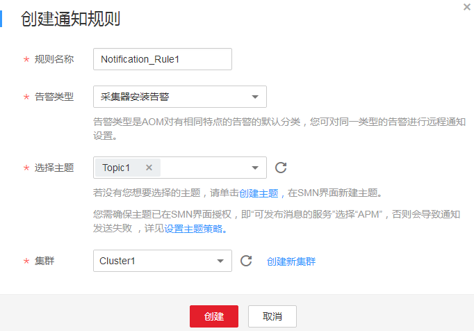

# 告警通知

告警可帮您将集群的某类告警以短信或邮件方式批量发送给您指定的用户，以便在第一时间获取到集群的异常状况，进而迅速处理故障，避免造成业务损失。

您最多可创建10个通知规则，如果通知规则数量已达上限10个时，请删除不需要的通知规则后重新创建。

如果您未创建任何通知规则，则无法收到告警通知。您只能登录[应用性能管理](https://console.huaweicloud.com/apm/)，在左侧导航栏中选择“告警中心 \> 告警列表”，在告警页面自行查看。

APM目前支持对[表1](#table1767992833014)中的告警创建通知规则。

**表 1**  告警类型说明

<table><thead align="left"><tr id="row1290320620271"><th class="cellrowborder" valign="top" width="20%" id="mcps1.2.3.1.1">
告警类型

</th>
<th class="cellrowborder" valign="top" width="80%" id="mcps1.2.3.1.2">
说明

</th>
</tr>
</thead>
<tbody><tr id="row32101939183018"><td class="cellrowborder" valign="top" width="20%" headers="mcps1.2.3.1.1 ">
探针休眠

</td>
<td class="cellrowborder" valign="top" width="80%" headers="mcps1.2.3.1.2 ">
探针休眠产生的告警。

</td>
</tr>
<tr id="row468220287303"><td class="cellrowborder" valign="top" width="20%" headers="mcps1.2.3.1.1 ">
采集器安装告警

</td>
<td class="cellrowborder" valign="top" width="80%" headers="mcps1.2.3.1.2 ">
包括ICAgent安装失败告警、ICAgent升级失败告警、ICAgent卸载失败告警和ICAgent状态异常告警。

</td>
</tr>
<tr id="row1880916772819"><td class="cellrowborder" valign="top" width="20%" headers="mcps1.2.3.1.1 ">
阈值告警

</td>
<td class="cellrowborder" valign="top" width="80%" headers="mcps1.2.3.1.2 ">
阈值规则产生的阈值告警。

</td>
</tr>
</tbody>
</table>

> **说明：**   
>更多告警类型正在开发中。  

## 创建通知规则

1.  登录[应用性能管理](https://console.huaweicloud.com/apm/)。
2.  在左侧导航栏中选择“告警中心 \> 通知规则”，单击“创建通知规则”。
3.  创建主题并设置主题策略后，为主题添加订阅者。如果均已设置，请跳过该步骤。

    APM已对接消息通知服务（Simple Message Notification，简称SMN），单击“创建主题”进入SMN界面。您首先需在SMN界面创建一个主题，并参考[图1](#fig93881957534)设置主题策略，否则会导致告警通知发送失败，然后再为这个主题添加相关的订阅者，即告警通知的接收人（短信或邮件），详细操作请分别参见《消息通知服务用户指南》的[创建主题](https://support.huaweicloud.com/usermanual-smn/zh-cn_topic_0043961401.html)、[设置主题策略](https://support.huaweicloud.com/usermanual-smn/zh-cn_topic_0043394891.html)、[订阅主题](https://support.huaweicloud.com/usermanual-smn/zh-cn_topic_0043961402.html)页面。这样在集群发生异常时，APM可以实时地将告警信息以广播的方式通知这些订阅者。

    **图 1**  设置主题策略  
    

4.  输入规则名称，选择告警类型（即当产生哪一类型的告警时发送通知，详见[表1](#table1767992833014)），选择[3](#li8403180175)中已创建的主题，并自定义监控集群后，单击“创建”，如[图2](#fig2143205461110)所示。

    通知规则创建完成后，当产生符合该通知规则的告警时，APM会通过短信或邮件的方式自动通知。

    **图 2**  创建通知规则  
    

## 更多通知规则操作

通知规则创建完成后，您还可以执行[表2](#table14918185010104)中的操作。

**表 2**  相关操作

<table><thead align="left"><tr id="row17920135010100"><th class="cellrowborder" valign="top" width="20%" id="mcps1.2.3.1.1">
操作

</th>
<th class="cellrowborder" valign="top" width="80%" id="mcps1.2.3.1.2">
说明

</th>
</tr>
</thead>
<tbody><tr id="row4922150191019"><td class="cellrowborder" valign="top" width="20%" headers="mcps1.2.3.1.1 ">
修改通知规则

</td>
<td class="cellrowborder" valign="top" width="80%" headers="mcps1.2.3.1.2 ">
单击“操作”列的“修改”。

</td>
</tr>
<tr id="row13752165816484"><td class="cellrowborder" valign="top" width="20%" headers="mcps1.2.3.1.1 ">
删除通知规则

</td>
<td class="cellrowborder" valign="top" width="80%" headers="mcps1.2.3.1.2 "><ul id="ul98211552932"><li>删除一个通知规则：单击“操作”列的“删除”。</li><li>删除一个或多个通知规则：选中一个或多个通知规则前的复选框，单击页面上方的“删除”。</li></ul>
</td>
</tr>
<tr id="row79230504106"><td class="cellrowborder" valign="top" width="20%" headers="mcps1.2.3.1.1 ">
搜索通知规则

</td>
<td class="cellrowborder" valign="top" width="80%" headers="mcps1.2.3.1.2 ">
在右上角的搜索框中输入通知规则名称关键字，单击后显示匹配对象。

</td>
</tr>
</tbody>
</table>

