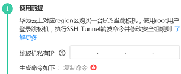
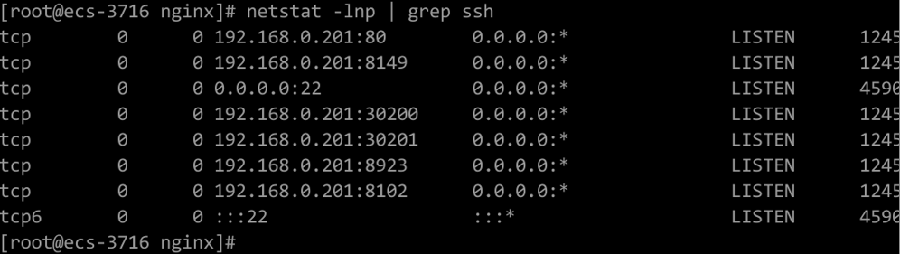
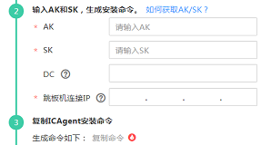

# 安装ICAgent<a name="apm_02_0046"></a>

## 前提条件<a name="section789175015231"></a>

-   已购买弹性云服务器ECS作为跳板机。
-   满足[支持的操作系统](https://support.huaweicloud.com/productdesc-apm/apm_06_0007.html)，支持amd64处理器架构。
-   弹性云服务器已[绑定弹性IP地址](http://support.huaweicloud.com/usermanual-vpc/zh-cn_topic_0013748738.html)。
-   确保本地浏览器的时间与弹性云服务器的时区、时间一致。

## 操作步骤<a name="zh-cn_topic_0089582074_zh-cn_topic_0089684077_section154003208582"></a>

非华为云上的服务器安装ICAgent，请先在华为云上购买一台弹性云服务器作为跳板机，然后执行如下操作：

> **说明：**   
>推荐CentOS 6.5 64bit及其以上版本的镜像， 最低规格为1vCPUs | 1GB，推荐规格为2vCPUs | 4GB。  

1.  登录[弹性云服务器](http://support.huaweicloud.com/qs-ecs/zh-cn_topic_0092494193.html)，修改跳板机ECS使用的安全组规则。
    1.  在ECS详情页，单击安全组页签，进入安全组列表页。
    2.  单击具体的安全组名，单击“更改安全组规则”，进入安全组详情页。
    3.  在该安全组详情页，单击“入方向规则 \> 添加规则 ”，按[表 安全组规则](#table1218216483590)添加安全组规则。

        **表 1**  安全组规则

        <a name="table1218216483590"></a>
        <table><thead align="left"><tr id="row1518374812594"><th class="cellrowborder" valign="top" width="25%" id="mcps1.2.5.1.1"><p id="p3650341106"><a name="p3650341106"></a><a name="p3650341106"></a>方向</p>
        </th>
        <th class="cellrowborder" valign="top" width="21.65%" id="mcps1.2.5.1.2"><p id="p1265018414012"><a name="p1265018414012"></a><a name="p1265018414012"></a>协议</p>
        </th>
        <th class="cellrowborder" valign="top" width="28.349999999999998%" id="mcps1.2.5.1.3"><p id="p06501541503"><a name="p06501541503"></a><a name="p06501541503"></a>端口</p>
        </th>
        <th class="cellrowborder" valign="top" width="25%" id="mcps1.2.5.1.4"><p id="p46501442015"><a name="p46501442015"></a><a name="p46501442015"></a>说明</p>
        </th>
        </tr>
        </thead>
        <tbody><tr id="row9183948185912"><td class="cellrowborder" valign="top" width="25%" headers="mcps1.2.5.1.1 "><p id="p14650164503"><a name="p14650164503"></a><a name="p14650164503"></a>入方向</p>
        </td>
        <td class="cellrowborder" valign="top" width="21.65%" headers="mcps1.2.5.1.2 "><p id="p1765004407"><a name="p1765004407"></a><a name="p1765004407"></a>TCP</p>
        </td>
        <td class="cellrowborder" valign="top" width="28.349999999999998%" headers="mcps1.2.5.1.3 "><p id="p10650741016"><a name="p10650741016"></a><a name="p10650741016"></a>8149、8102、8923、30200、30201、80</p>
        </td>
        <td class="cellrowborder" valign="top" width="25%" headers="mcps1.2.5.1.4 "><p id="p126501419016"><a name="p126501419016"></a><a name="p126501419016"></a>ICAgent发送数据到跳板机的端口列表。</p>
        </td>
        </tr>
        </tbody>
        </table>

        > **说明：**   
        >将安全组的入方向端口8149、8102、8923、30200、30201、80开启，保证非华为云的VM到跳板机ECS的数据连通性。  


2.  在左侧导航栏中选择“采集管理 \> Agent管理”。
3.  选择“其他: 用户自定义接入主机”，单击“安装ICAgent”，选择“主机类型”为“非华为云主机”。
4.  在跳板机上开通转发端口。
    1.  如[图 跳板机私有IP](#fig0216194792214)所示，输入跳板机私有IP，生成跳板机转发命令。

        **图 1**  跳板机私有IP<a name="fig0216194792214"></a>  
        

        > **说明：**   
        >跳板机私有IP是指VPC内网IP。  

    2.  单击“复制命令”，复制跳板机转发命令。
    3.  以**root**用户登录跳板机，执行SSH Tunnel转发命令。

        ```
        ssh -f -N -L {跳板机ip}:8149:{elbip}:8149 -L {跳板机ip}:8102:{elbip}:8102 -L {跳板机ip}:8923:{elbip}:8923 -L {跳板机ip}:30200:{elbip}:30200 -L {跳板机ip}:30201:{elbip}:30201 -L {跳板机ip}:80:icagent-{region}.obs.{region}.myhuaweicloud.com:80 {跳板机ip}
        ```

        根据命令提示输入root用户密码即可。

    4.  执行**netstat -lnp | grep ssh**命令查看对应端口是否被侦听，如果返回结果如[图2](#fig2754142620246)所示，说明TCP端口已开通。

        **图 2**  TCP端口验证结果<a name="fig2754142620246"></a>  
        

        > **说明：**   
        >-   在浏览器地址栏里输入“http://跳板机ECS的IP地址”。如果访问成功，说明安全组规则已经生效。  
        >-   如果跳板机ECS掉电重启，请重新执行如上命令。  
        >-   混合云场景下，监控数据是通过ssh tunnel跳板机转发至APM，若该进程异常，您可以参考[如何处理SSH tunnel进程异常？](https://support.huaweicloud.com/apm_faq/apm_03_0020.html)来处理。  


5.  获取AK/SK，请参考[如何获取AK/SK](http://support.huaweicloud.com/apm_faq/apm_03_0001.html)。
6.  生成ICAgent安装命令，并复制该命令。
    1.  如[图 获取AK/SK凭证](#fig179731891205)所示，在文本框中输入AK、SK、DC和跳板机连接IP，生成ICAgent安装命令。

        **图 3**  获取AK/SK凭证<a name="fig179731891205"></a>  
        

        > **说明：**   
        >-   请确保输入正确的AK/SK，否则将无法安装ICAgent。  
        >-   DC：自定义节点所属数据中心名称，便于分类查看主机。  
        >-   跳板机连接IP：使用EIP方式连接，为跳板机弹性公网IP，使用云专线VPC对等连接方式，为跳板机VPC内网IP。  

    2.  单击“复制命令”，复制ICAgent安装命令。

7.  使用远程登录工具，以**root**用户登录待安装ICAgent的服务器，执行ICAgent安装命令进行安装。

    当显示“ICAgent install success”时，表示安装成功，ICAgent已安装在了/opt/oss/servicemgr/目录。安装成功后，在应用性能管理左侧导航栏中选择“采集管理 \> Agent管理”，查看该服务器ICAgent状态。


