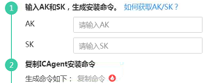

# 安装ICAgent（Linux）<a name="apm_02_0013"></a>

## 前提条件<a name="section789175015231"></a>

ICAgent是采集代理，在进行ICAgent安装前，需要先确保本地浏览器时间与服务器时区、时间都一致。若有多个服务器，则要保证本地浏览器、多个服务器的时区、时间都一致。否则，可能会导致安装后不能在界面上准确查看应用的拓扑、调用链等数据。

## 安装方式说明<a name="s92be8217a4424177900b3c3ee8e18252"></a>

ICAgent有两种安装方式，您可以按照您的场景进行选择。您需要注意的是，下述两种安装方式，都不适用于容器节点（通过ServiceStage、AOS、CCE创建的集群容器节点），容器节点要使用APM，可参考[快速入门](https://support.huaweicloud.com/qs-apm/apm_00_0002.html)根据应用的部署方式进行操作。安装方式见[表1](#tb05ee4f9586147febd916e12635ec479)：

**表 1**  安装方式

<a name="tb05ee4f9586147febd916e12635ec479"></a>
<table><thead align="left"><tr id="rfadec82993774eecad4045fd0084a7e3"><th class="cellrowborder" valign="top" width="20.3%" id="mcps1.2.3.1.1"><p id="a108f75632f5442ca8d434a5b21f60dba"><a name="a108f75632f5442ca8d434a5b21f60dba"></a><a name="a108f75632f5442ca8d434a5b21f60dba"></a>方式</p>
</th>
<th class="cellrowborder" valign="top" width="79.7%" id="mcps1.2.3.1.2"><p id="a392e44500cc54b1ab0ea6c2ae6df47be"><a name="a392e44500cc54b1ab0ea6c2ae6df47be"></a><a name="a392e44500cc54b1ab0ea6c2ae6df47be"></a>适用场景</p>
</th>
</tr>
</thead>
<tbody><tr id="r94b3003724fe4c8085af2b7c38fcc3ca"><td class="cellrowborder" valign="top" width="20.3%" headers="mcps1.2.3.1.1 "><p id="ac918cd34d30b409eb786d88d38b0110d"><a name="ac918cd34d30b409eb786d88d38b0110d"></a><a name="ac918cd34d30b409eb786d88d38b0110d"></a>首次安装</p>
</td>
<td class="cellrowborder" valign="top" width="79.7%" headers="mcps1.2.3.1.2 "><p id="a97667717ea874fe1b5c02b3791e9d1ae"><a name="a97667717ea874fe1b5c02b3791e9d1ae"></a><a name="a97667717ea874fe1b5c02b3791e9d1ae"></a>当满足以下条件时，您需要按照该方式安装：</p>
<a name="o5e09c0b6056c4191b514c97dd1f49f57"></a><a name="o5e09c0b6056c4191b514c97dd1f49f57"></a><ol id="o5e09c0b6056c4191b514c97dd1f49f57"><li>服务器已经绑定了EIP。绑定EIP的详细操作请参见<a href="http://support.huaweicloud.com/usermanual-vpc/zh-cn_topic_0013748738.html" target="_blank" rel="noopener noreferrer">为弹性云服务器申请和绑定弹性IP</a>。</li><li>该服务器上未安装过ICAgent。</li></ol>
</td>
</tr>
<tr id="r90456dcb4d0e495599323b6436471e4d"><td class="cellrowborder" valign="top" width="20.3%" headers="mcps1.2.3.1.1 "><p id="aac5aa7d6f2dd414a826151678794b8e6"><a name="aac5aa7d6f2dd414a826151678794b8e6"></a><a name="aac5aa7d6f2dd414a826151678794b8e6"></a>继承安装</p>
</td>
<td class="cellrowborder" valign="top" width="79.7%" headers="mcps1.2.3.1.2 "><p id="a66bde195c162464cb2b987b070e78845"><a name="a66bde195c162464cb2b987b070e78845"></a><a name="a66bde195c162464cb2b987b070e78845"></a>当满足以下条件时，您需要按照该方式安装：</p>
<p id="a7770ddfc1fd04661bfffc14a857a9a15"><a name="a7770ddfc1fd04661bfffc14a857a9a15"></a><a name="a7770ddfc1fd04661bfffc14a857a9a15"></a>您有多个服务器需要安装ICAgent，其中一个服务器绑定了EIP，而剩余的没有绑定EIP。其中一个服务器已经通过首次安装方式装好了ICAgent，对于没有绑定EIP的服务器，您可以采用该安装方式。</p>
</td>
</tr>
</tbody>
</table>

## 首次安装<a name="s3394edd5be6c4368ae172df353efb555"></a>

您在华为云上申请服务器后，在Linux环境下安装ICAgent，需执行如下操作：

1.  获取AK/SK，通过如下两种方式获取AK/SK：
    -   通过创建委托获取临时AK/SK，请参考[如何通过创建委托获取AK/SK](http://support.huaweicloud.com/apm_faq/apm_03_0002.html)章节获取AK/SK。

        > **说明：**   
        >安装ICAgent的每个ECS节点需要在弹性云服务器界面上绑定已创建的委托，5分钟后委托生效。  

    -   通过新增访问密钥获取永久AK/SK，请参考[如何获取AK/SK](http://support.huaweicloud.com/apm_faq/apm_03_0001.html)章节获取AK/SK。

2.  在左侧导航栏中选择“采集管理 \> Agent管理”。
3.  单击“安装ICAgent”，选择“主机类型”为“华为云主机”、“安装系统”为“Linux”。
4.  生成ICAgent安装命令，并复制该命令。
    -   如[图1](#fig1530116139572)所示，如果您已获取永久AK/SK，选择“安装方式”为“获取AK/SK凭证”，请在文本框中输入已获取的AK/SK，生成ICAgent安装命令。单击“复制命令”，复制ICAgent安装命令。

        **图 1**  获取AK/SK凭证<a name="fig1530116139572"></a>  
        

        > **说明：**   
        >请确保输入正确的AK/SK，否则将无法安装ICAgent。  

    -   如果您已通过创建委托获取临时AK/SK，选择“安装方式”为“创建IAM委托”，单击“复制命令”，复制ICAgent安装命令。

5.  使用远程登录工具，以**root**用户登录待安装ICAgent的服务器，执行ICAgent安装命令进行安装。

    > **说明：**   
    >-   当显示“ICAgent install success”时，表示安装成功，ICAgent已安装在了/opt/oss/servicemgr/目录。安装成功后，在应用性能管理左侧导航栏中选择“采集管理 \> Agent管理”，查看该服务器ICAgent状态。  
    >-   安装失败，请参考卸载ICAgent章节的[卸载ICAgent（Linux）](卸载ICAgent（Linux）.md)后重新安装，如果还未安装成功，请联系华为云工程师。  


## 继承安装<a name="s67a66a0bf8bd417e9e71342699bb2b7e"></a>

当您已有服务器安装过ICAgent，且该服务器“/opt/ICAgent/“路径下ICAgent安装包**ICProbeAgent.tar.gz**存在，通过该方式可对远端服务器进行一键式继承安装。

1.  在已安装ICAgent的服务器上执行如下命令，其中_x.x.x.x_表示服务器IP地址。

    **bash /opt/oss/servicemgr/ICAgent/bin/remoteInstall/remote\_install.sh -ip** **x.x.x.x**

2.  根据提示输入待安装ICAgent的服务器root用户密码。

    > **说明：**   
    >-   如果已安装ICAgent的服务器安装过expect工具，执行上述命令后，即可完成安装。如果已安装ICAgent的服务器未安装expect工具，请根据提示输入，进行安装。  
    >-   请确保已安装ICAgent的服务器可以使用root用户执行SSH、SCP命令，来与待安装ICAgent的服务器进行远端通信。  
    >-   当显示“ICAgent install success”时，表示安装成功，ICAgent已安装在了/opt/oss/servicemgr/目录。安装成功后，在应用性能管理左侧导航栏中选择“采集管理 \> Agent管理”，查看该服务器ICAgent状态。  
    >-   安装失败，请参考卸载ICAgent章节的[卸载ICAgent（Linux）](卸载ICAgent（Linux）.md)后重新安装，如果还未安装成功，请联系华为云工程师。  


## 继承批量安装<a name="section844164283613"></a>

当您已有服务器安装过ICAgent，且该服务器“/opt/ICAgent/”路径下ICAgent安装包**ICProbeAgent.tar.gz**存在，通过该方式可对多个远端服务器进行一键式继承批量安装。

> **须知：**   
>批量安装的ECS需同属一个VPC下，并在同一个网段中。  

**前提条件**

已收集需要安装Agent的所有虚拟机IP、密码，按照iplist.cfg格式整理好，并上传到已安装过ICAgent机器的/opt/ICAgent/目录下。iplist.cfg格式示例如下所示，IP与密码之间用空格隔开：

_192.168.0.109 密码（请根据实际填写）_

_192.168.0.39 密码（请根据实际填写）_

> **说明：**   
>-   iplist.cfg中包含您的敏感信息，建议您使用完之后清理一下。  
>-   如果所有弹性云服务器的密码一致，iplist.cfg中只需列出IP，无需填写密码，在执行时输入此密码即可；如果某个IP密码与其他不一致，则需在此IP后填写其密码。  

**操作步骤**

1.  在已安装ICAgent的服务器上执行如下命令。

    **_bash /opt/oss/servicemgr/ICAgent/bin/remoteInstall/remote\_install.sh -batchModeConfig /opt/ICAgent/iplist.cfg_**

    根据脚本提示输入待安装机器的root用户默认密码，如果所有IP的密码在iplist.cfg中已有配置，则直接输入回车键跳过即可，否则请输入默认密码。

    ```
    batch install begin
    Please input default passwd:
    send cmd to 192.168.0.109
    send cmd to 192.168.0.39
    2 tasks running, please wait...
    2 tasks running, please wait...
    2 tasks running, please wait...
    End of install agent: 192.168.0.39
    End of install agent: 192.168.0.109
    All hosts install icagent finish.
    ```

    请耐心等待，当提示All hosts install icagent finish.时，则表示配置文件中的所有主机安装操作已完成。

2.  安装完成后，在应用性能管理左侧导航栏中选择“采集管理 \> Agent管理”，查看该服务器ICAgent状态。

## ICAgent状态<a name="section16256173094912"></a>

ICAgent状态说明详见下表。

**表 2**  ICAgent状态

<a name="table918112917487"></a>
<table><thead align="left"><tr id="row171827299483"><th class="cellrowborder" valign="top" width="20%" id="mcps1.2.3.1.1"><p id="p3182229114817"><a name="p3182229114817"></a><a name="p3182229114817"></a>状态</p>
</th>
<th class="cellrowborder" valign="top" width="80%" id="mcps1.2.3.1.2"><p id="p618218296482"><a name="p618218296482"></a><a name="p618218296482"></a>说明</p>
</th>
</tr>
</thead>
<tbody><tr id="row61827298484"><td class="cellrowborder" valign="top" width="20%" headers="mcps1.2.3.1.1 "><p id="p318232914817"><a name="p318232914817"></a><a name="p318232914817"></a>运行</p>
</td>
<td class="cellrowborder" valign="top" width="80%" headers="mcps1.2.3.1.2 "><p id="p11182202944819"><a name="p11182202944819"></a><a name="p11182202944819"></a>该主机ICAgent运行正常。</p>
</td>
</tr>
<tr id="row16182329144820"><td class="cellrowborder" valign="top" width="20%" headers="mcps1.2.3.1.1 "><p id="p218218298488"><a name="p218218298488"></a><a name="p218218298488"></a>未安装</p>
</td>
<td class="cellrowborder" valign="top" width="80%" headers="mcps1.2.3.1.2 "><p id="p31821629154819"><a name="p31821629154819"></a><a name="p31821629154819"></a>该主机未安装ICAgent。安装ICAgent，详细操作请参见<a href="安装ICAgent（Linux）.md">安装ICAgent（Linux）</a>。</p>
</td>
</tr>
<tr id="row18183429114819"><td class="cellrowborder" valign="top" width="20%" headers="mcps1.2.3.1.1 "><p id="p1418317292488"><a name="p1418317292488"></a><a name="p1418317292488"></a>安装中</p>
</td>
<td class="cellrowborder" valign="top" width="80%" headers="mcps1.2.3.1.2 "><p id="p218352914486"><a name="p218352914486"></a><a name="p218352914486"></a>正在为该主机安装ICAgent。安装ICAgent预计需要1分钟左右，请耐心等待。</p>
</td>
</tr>
<tr id="row8183729134820"><td class="cellrowborder" valign="top" width="20%" headers="mcps1.2.3.1.1 "><p id="p3183162915486"><a name="p3183162915486"></a><a name="p3183162915486"></a>安装失败</p>
</td>
<td class="cellrowborder" valign="top" width="80%" headers="mcps1.2.3.1.2 "><p id="p16183729134819"><a name="p16183729134819"></a><a name="p16183729134819"></a>该主机ICAgent安装失败，请<a href="卸载ICAgent（Linux）.md#s3b88a85d5fc54597bdb601e26408a808">登录服务器卸载</a>后重新安装。</p>
</td>
</tr>
<tr id="row81831029164812"><td class="cellrowborder" valign="top" width="20%" headers="mcps1.2.3.1.1 "><p id="p718314293480"><a name="p718314293480"></a><a name="p718314293480"></a>升级中</p>
</td>
<td class="cellrowborder" valign="top" width="80%" headers="mcps1.2.3.1.2 "><p id="p5183122994811"><a name="p5183122994811"></a><a name="p5183122994811"></a>正在升级该主机ICAgent。升级ICAgent预计需要1分钟左右，请耐心等待。</p>
</td>
</tr>
<tr id="row1118342954813"><td class="cellrowborder" valign="top" width="20%" headers="mcps1.2.3.1.1 "><p id="p8183182919487"><a name="p8183182919487"></a><a name="p8183182919487"></a>升级失败</p>
</td>
<td class="cellrowborder" valign="top" width="80%" headers="mcps1.2.3.1.2 "><p id="p31831029144819"><a name="p31831029144819"></a><a name="p31831029144819"></a>该主机ICAgent升级失败。请<a href="卸载ICAgent（Linux）.md#s3b88a85d5fc54597bdb601e26408a808">登录服务器卸载</a>后重新安装。</p>
</td>
</tr>
<tr id="row31831729154813"><td class="cellrowborder" valign="top" width="20%" headers="mcps1.2.3.1.1 "><p id="p018319297483"><a name="p018319297483"></a><a name="p018319297483"></a>离线</p>
</td>
<td class="cellrowborder" valign="top" width="80%" headers="mcps1.2.3.1.2 "><p id="p15183162934810"><a name="p15183162934810"></a><a name="p15183162934810"></a>输入的AK/SK错误或ECS委托设置错误导致该主机ICAgent功能异常。请获取正确的AK/SK或正确设置ECS委托。</p>
</td>
</tr>
<tr id="row718332984814"><td class="cellrowborder" valign="top" width="20%" headers="mcps1.2.3.1.1 "><p id="p141831029124817"><a name="p141831029124817"></a><a name="p141831029124817"></a>异常</p>
</td>
<td class="cellrowborder" valign="top" width="80%" headers="mcps1.2.3.1.2 "><p id="p8183129104810"><a name="p8183129104810"></a><a name="p8183129104810"></a>该主机ICAgent功能异常，请联系技术支持。</p>
</td>
</tr>
</tbody>
</table>

