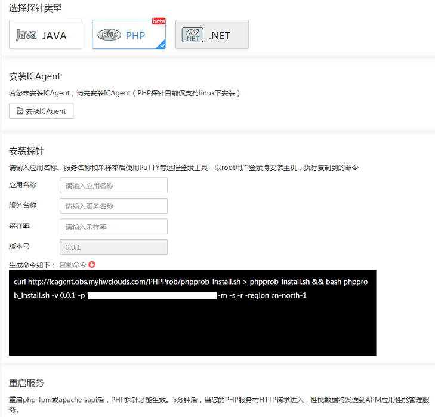

# 安装PHP探针

## 前提条件

-   已完成ICAgent安装。
-   满足APM支持的[Linux操作系统](https://support.huaweicloud.com/productdesc-apm/apm_06_0007.html)。
-   满足APM支持的[PHP类型](https://support.huaweicloud.com/productdesc-apm/apm_06_0007.html)。

## 安装PHP探针

1.  在左侧导航栏中选择“采集管理 \>探针安装”。
2.  选择探针类型为“PHP”。
3.  （可选）[安装ICAgent](安装ICAgent（Linux）.md)。如果您已安装ICAgent，请跳过此步骤。

    > **说明：**   
    >PHP探针仅支持Linux系统下ICAgent的安装方式。  

4.  参考[表 参数说明](#zh-cn_topic_0114121306_tc77c337fd6654f05885648b51c3f016d)输入应用名称、服务名称和采样率。

    **表 1**  参数说明

    
    <table><thead align="left"><tr id="zh-cn_topic_0114121306_ra6391e2ab5214123a1a44a87d60c5582"><th class="cellrowborder" valign="top" width="32%" id="mcps1.2.3.1.1">
参数

    </th>
    <th class="cellrowborder" valign="top" width="68%" id="mcps1.2.3.1.2">
取值说明

    </th>
    </tr>
    </thead>
    <tbody><tr id="zh-cn_topic_0114121306_rdb6ae5c75a894098be04e07c8a93f6b1"><td class="cellrowborder" valign="top" width="32%" headers="mcps1.2.3.1.1 ">
应用名称

    </td>
    <td class="cellrowborder" valign="top" width="68%" headers="mcps1.2.3.1.2 ">
只能由小写字母、数字、中划线（-）、下划线（_）组成，且以小写字母或下划线（_）开头，长度限制为1~64位字符。

    </td>
    </tr>
    <tr id="zh-cn_topic_0114121306_r534299532600473290fc80b6a6731248"><td class="cellrowborder" valign="top" width="32%" headers="mcps1.2.3.1.1 ">
服务名称

    </td>
    <td class="cellrowborder" valign="top" width="68%" headers="mcps1.2.3.1.2 ">
组成该应用的微服务名称。

    
只能由小写字母、数字、中划线（-）、下划线（_）组成，且以小写字母或下划线（_）开头，长度限制为1~64位字符。

    </td>
    </tr>
    <tr id="zh-cn_topic_0114121306_r1deb74cb647d4e29943d5d571fb765f7"><td class="cellrowborder" valign="top" width="32%" headers="mcps1.2.3.1.1 ">
采样率

    </td>
    <td class="cellrowborder" valign="top" width="68%" headers="mcps1.2.3.1.2 ">
0~1之间的数字。

    </td>
    </tr>
    <tr id="row458014311332"><td class="cellrowborder" valign="top" width="32%" headers="mcps1.2.3.1.1 ">
版本号

    </td>
    <td class="cellrowborder" valign="top" width="68%" headers="mcps1.2.3.1.2 ">
版本号由后台获取，无需用户输入。

    </td>
    </tr>
    </tbody>
    </table>

    

5.  使用远程登录工具以root用户登录待安装PHP探针的服务器，执行复制的PHP探针安装命令。
6.  重启PHP应用，5分钟后，PHP应用的性能数据就会呈现在应用性能管理服务界面上。

    当PHP应用服务出现HTTP请求接入，说明您已经成功监控到PHP应用的性能数据。

