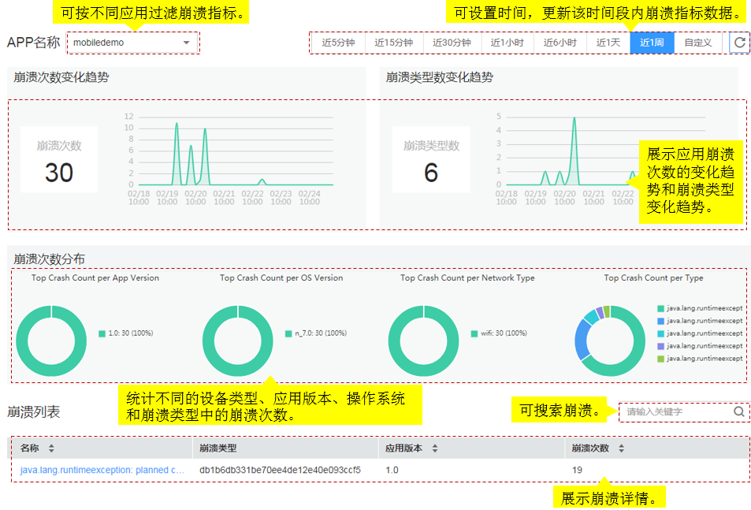

# 崩溃分析

该功能仅对华北-北京一区域生效。

## 产生背景

Crash是指应用进程崩溃，空指针异常或未捕捉的异常导致系统弹出窗口提示用户某进程崩溃或直接闪退。由于APP的Crash通常发生在用户手机侧，如果不能复现APP的Crash，则很难定位Crash问题根因。当出现应用崩溃时，APM端侧探针通过非侵入式埋点技术采集应用的Crash指标数据（设备参数、Java异常），并将崩溃信息展示在崩溃分析页面中。华为云应用性能管理Mobile为您提供Crash统计指标和展示Crash详情的能力，从而快速定位解决APP性能问题，提升用户体验。

## 问题定位

如何分析Crash问题？当APP出现Crash时，先查看日志（Crash时间、进程、Crash类型）和Java堆栈信息，再解析堆栈，定位产生Crash的具体原因。

应用崩溃的主要原因：

-   设备类型：机型众多，各个硬件厂商可能会定制只读存储器更改系统方法导致特定机型的崩溃。
-   操作系统：设备多样性可能存在兼容性问题，APP在不同的设备上可能会有不同的表现。
-   内存管理错误：可用内存过低，APP所需的内存超过设备的限制导致App Crash；内存泄露，程序运行的时间越长，所占用的内存越大，最终用尽全部内存，导致整个系统崩溃；非授权的内存位置的使用也可能会导致App Crash。
-   程序逻辑错误：数组越界、堆栈溢出、并发操作或逻辑错误。

## 界面说明

## 操作步骤

1.  登录应用性能管理。
2.  选择“Mobile \> 崩溃分析”，进入“崩溃分析”界面。
3.  在“崩溃分析”页面中，选择应用名称，设置查询时间，单击“查询”。
4.  查看“崩溃次数”，展示设置时间段内应用的崩溃次数变化趋势。
5.  查看“崩溃类型”，展示设置时间段内应用的崩溃类型变化趋势。
6.  查看“崩溃次数分布”，按照不同的设备类型、应用版本、操作系统和崩溃类型统计崩溃次数，识别频繁出现崩溃的设备类型、应用版本、操作系统和崩溃类型，为分析应用崩溃原因提供参考依据。

    您也可以单击“APP端汇总”页面的崩溃次数趋势图中某时间点上的崩溃次数，跳转到崩溃分析页面查看崩溃次数分布。

    > **说明：**   
    >崩溃类型是指Java异常名称，Java常见异常：  
    >-   java.lang.NullPointerException：空指针，调用未经初始化的对象或者不存在的对象。  
    >-   java.lang.ClassNotFoundException：指定的类不存在。  
    >-   java.lang.ArithmeticException：数学运算异常。  
    >-   java.lang.ArrayIndexOutOfBoundsException：数组下标越界。  
    >-   java.lang.IllegalArgumentException：方法的参数错误。  
    >-   java.lang.IllegalAccessException：没有访问权限。  

7.  查看“崩溃列表”，展示崩溃名称、崩溃类型、应用版本和崩溃次数。
8.  单击“崩溃名称”，进入“崩溃详情”界面，查看应用崩溃详情。
    -   展示崩溃名称、崩溃类型、发生崩溃的总次数和崩溃发现的最近时间。
    -   查看应用崩溃视图，展示事件数据（地理位置、网络类型、发生时间）、设备数据（操作系统、设备、设备特征）、APP数据（软件版本、软件包名称、版本编码）。
    -   查看应用的堆栈追踪、线程转储和日志信息。

