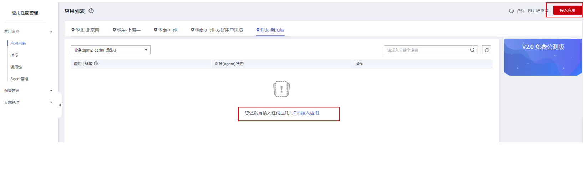

# 快速接入Agent

## 前提条件

确保接入APM的机器与APM服务网络连通。

<table><thead align="left"><tr id="row222242032818"><th class="cellrowborder" valign="top" width="29.09%" id="mcps1.1.3.1.1">
区域

</th>
<th class="cellrowborder" valign="top" width="70.91%" id="mcps1.1.3.1.2">
联通测试

</th>
</tr>
</thead>
<tbody><tr id="row17222102010285"><td class="cellrowborder" valign="top" width="29.09%" headers="mcps1.1.3.1.1 ">
北京四

</td>
<td class="cellrowborder" valign="top" width="70.91%" headers="mcps1.1.3.1.2 ">
telnet 100.125.12.108 41333

telnet 100.125.12.108 41335

</td>
</tr>
<tr id="row166160599210"><td class="cellrowborder" valign="top" width="29.09%" headers="mcps1.1.3.1.1 ">
上海一

</td>
<td class="cellrowborder" valign="top" width="70.91%" headers="mcps1.1.3.1.2 ">
telnet 100.125.4.27 41333

telnet 100.125.4.27 41335

</td>
</tr>
<tr id="row16212310141814"><td class="cellrowborder" valign="top" width="29.09%" headers="mcps1.1.3.1.1 ">
广州

</td>
<td class="cellrowborder" valign="top" width="70.91%" headers="mcps1.1.3.1.2 ">
telnet 100.125.143.102 41333

telnet 100.125.143.102 41335

</td>
</tr>
<tr id="row28645123181"><td class="cellrowborder" valign="top" width="29.09%" headers="mcps1.1.3.1.1 ">
新加坡

</td>
<td class="cellrowborder" valign="top" width="70.91%" headers="mcps1.1.3.1.2 ">
telnet 100.125.4.25 41333

telnet 100.125.4.25 41335

</td>
</tr>
</tbody>
</table>

## 操作步骤

1.  在左侧导航栏中选择“应用监控 \> 应用列表”。
2.  单击“接入应用”，进入接入应用页面。

    

3.  单击安装命令后的复制安装命令，然后在需要接入APM机器的任意目录执行。

    

4.  单击参数命令后的复制参数命令，将该参数添加到服务启动脚本的java命令。
5.  重启应用。

