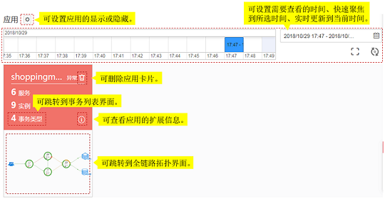

# 总览

应用是提供服务所需功能的软件，可以对相同或者相近业务的一组服务进行逻辑划分。您可以将某类相同业务的服务放到同一个应用中，并实现整个业务的应用性能管理。例如，可以将账户、产品、支付等服务，放入“商城”应用中。

通过应用您可以快速了解应用的健康情况。在总览界面中可进行如下操作：

**图 1**  总览界面  

以下场景中您可以删除卡片服务：

-   已经将接入APM的服务删除掉了。
-   已经将ICAgent卸载了且不需要再采集服务数据了。

如果您已接入APM的服务目前仍在运行中，则删除此卡片三分钟左右之后，该卡片会重新显示出来。

