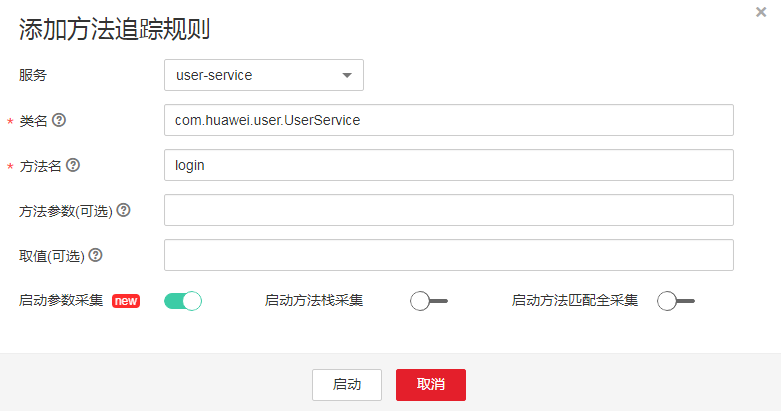

# 方法追踪

方法追踪是对某个类的某个方法进行动态埋点，当这个类的方法被调用时，APM采集探针会按照您配置的方法追踪规则对方法的调用数据进行采集，并将调用数据展现在调用链页面中。方法追踪主要用来帮助应用的开发人员在线定位方法级性能问题。

APM对三方开源组件发布的API进行埋点，但没有对您应用的特定方法进行埋点。当您需要监控应用中比较重要的方法，或APM不完全支持一些三方开源组件导致采集探针采集不到部分方法时，需要自定义方法追踪，配置完成后，您可在调用链页面查看该方法的调用信息。

1.  自定义方法追踪（即对应用进行埋点），并启动方法追踪。

    在“方法追踪”页面单击“添加方法追踪”，参考下图进行设置，设置完成后单击“启动”。

    

    > **说明：**   
    >-   若未设置“方法参数”，则默认对同一方法名的所用方法进行采集。  
    >-   若未设置“取值”，则采集时不对方法的取值进行筛选。  
    >-   若设置“启动参数采集”，则表示采集调用链方法入参和出参。  
    >-   若设置“启动方法栈采集”，则表示采集方法的调用栈信息。  
    >-   若设置“启动方法匹配全采集”，则表示采集所有的调用链方法；若未设置该选项，则表示根据[采集配置](采集配置.md)时设置的采样率（普通采样或智能采样）采集调用链方法。  

2.  在页面下方通过总调用耗时、调用状态初步定位业务性能问题。
3.  单击问题调用所在行“操作”列的“查看调用关系”，查看方法级的调用关系。

