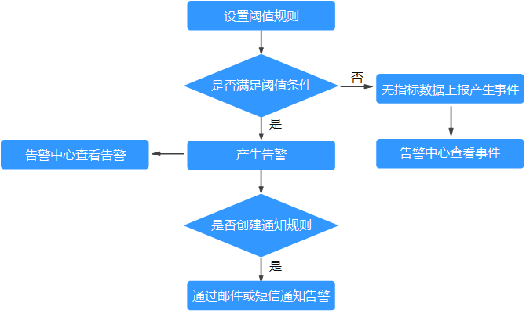
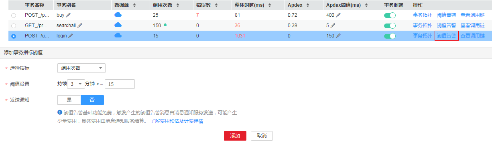
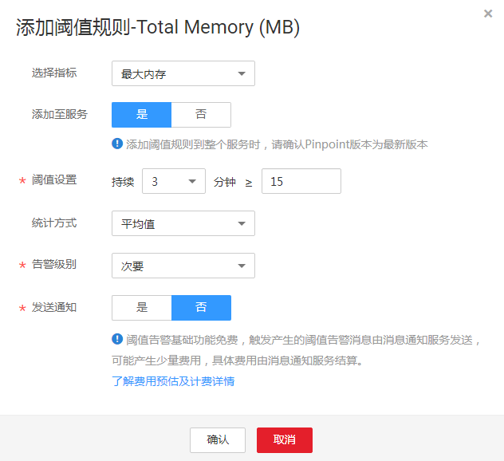

# 查看告警

告警是指APM自身，或AOS、ServiceStage、CCE等外部服务在异常情况或在可能导致异常情况下上报的信息，并且您需采取相应措施清除故障，否则会由于APM自身或外部服务的功能异常而引起业务的异常。

## 告警流程图

## 查看告警

1.  登录[应用性能管理](https://console.huaweicloud.com/apm/)。
2.  在左侧导航栏中选择“告警中心 \> 告警列表”。
3.  在“告警列表”页面中查看告警。
    1.  设置时间范围，查看已设时间范围内产生的告警。可通过如下两种方式设置时间范围：

        方式一：使用APM预定义好的时间标签，例如，近1小时、近6小时、近一天等，您可根据实际需要选择不同的时间粒度。

        方式二：通过开始时间和结束时间，自定义时间范围，您最长可设置为30天。

    2.  设置搜索条件后，单击“搜索”，查看在已设时间范围内满足搜索条件的告警。

        单击“重置”清除输入的搜索条件。

4.  您可参考[表1](#table48312734713)执行如下操作：

    **表 1**  操作说明

    
    <table><thead align="left"><tr id="row108311378473"><th class="cellrowborder" valign="top" width="20%" id="mcps1.2.4.1.1">
操作

    </th>
    <th class="cellrowborder" valign="top" width="40%" id="mcps1.2.4.1.2">
方法

    </th>
    <th class="cellrowborder" valign="top" width="40%" id="mcps1.2.4.1.3">
说明

    </th>
    </tr>
    </thead>
    <tbody><tr id="row28315714471"><td class="cellrowborder" valign="top" width="20%" headers="mcps1.2.4.1.1 ">
查看告警统计数据

    </td>
    <td class="cellrowborder" valign="top" width="40%" headers="mcps1.2.4.1.2 ">
通过柱状图查看在指定时间范围内和搜索条件下告警的统计数据。

    </td>
    <td class="cellrowborder" valign="top" width="40%" headers="mcps1.2.4.1.3 ">
-

    </td>
    </tr>
    <tr id="row88311976474"><td class="cellrowborder" valign="top" width="20%" headers="mcps1.2.4.1.1 ">
清除告警

    </td>
    <td class="cellrowborder" valign="top" width="40%" headers="mcps1.2.4.1.2 ">
在当前告警列表中单击目标告警所在“操作”列中的“清除”。

    </td>
    <td class="cellrowborder" valign="top" width="40%" headers="mcps1.2.4.1.3 "><ul id="ul18602183613499"><li>告警故障已经解除时可进行清除操作。</li><li>被执行清除操作后的告警将不能进行查询。</li></ul>
    </td>
    </tr>
    <tr id="row5831157194720"><td class="cellrowborder" valign="top" width="20%" headers="mcps1.2.4.1.1 ">
查看告警详情

    </td>
    <td class="cellrowborder" valign="top" width="40%" headers="mcps1.2.4.1.2 ">
单击目标告警所在“操作”列中的“查看”可查看告警详情。

    </td>
    <td class="cellrowborder" valign="top" width="40%" headers="mcps1.2.4.1.3 ">
-

    </td>
    </tr>
    <tr id="row383117717471"><td class="cellrowborder" valign="top" width="20%" headers="mcps1.2.4.1.1 ">
查看最新告警

    </td>
    <td class="cellrowborder" valign="top" width="40%" headers="mcps1.2.4.1.2 ">
单击页面右侧的，可查看最新上报的3条告警。

    </td>
    <td class="cellrowborder" valign="top" width="40%" headers="mcps1.2.4.1.3 ">
-

    </td>
    </tr>
    </tbody>
    </table>

## 设置事务阈值规则

APM支持当事务异常时发生告警。 您可以设置事务指标的阈值告警，当满足设置的告警条件时，告警会上报到告警中心，可以在导航栏的“告警中心 \> 告警列表”中查看。本次操作以添加事务的“调用次数”指标告警为例。

1.  在[事务列表](事务列表.md)界面，在操作列单击“阈值告警”，进入“添加事务指标阈值”页面。

    **图 1**  添加事务指标阈值  
    

2.  选择指标为“调用次数”。事务指标包括调用次数、整体时延、错误数、Apdex。
3.  阈值设置为“持续3分钟大于等于15次”。
4.  发送通知选择为“否”，单击“添加”，阈值告警设置完成。

    > **说明：**   
    >如果您想要收到短信通知，请选择“是”，详细操作请参见[告警通知](告警通知.md)。  

## 设置JVM阈值规则

APM支持当JVM内存和线程的各项指标异常时发生告警。 您可以设置实例的JVM指标阈值告警，当满足设置的告警条件时，告警会上报到告警中心，可以在导航栏的“告警中心 \> 告警列表”中查看。本次操作以添加实例总内存的“最大”指标告警为例。

1.  在[JVM监控](JVM监控.md)界面，单击实例总内存的“添加阈值规则”，进入“添加阈值规则”页面。

    **图 2**  添加阈值规则  
    

2.  选择指标为“最大内存”，指标包括最大内存、分配内存、使用内存。
3.  阈值设置为“持续3分钟大于等于15MB”。
4.  选择统计方式为“平均值”，统计方式包括最大值、最小值、平均值。
5.  选择告警级别为“次要”，告警级别包括紧急、重要、次要、提示。
6.  发送通知选择为“否”，单击“确认”，阈值告警设置完成。

    > **说明：**   
    >如果您想要收到短信通知，请选择“是”，详细操作请参见[告警通知](告警通知.md)。  

