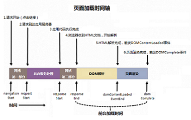
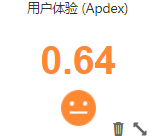

# 浏览器汇总

## Browser简介

华为云应用性能管理-Browser致力于为您提供清晰直观的前台性能监控数据，通过用户体验、吞吐量、错误数等多项指标，为您展现不同维度的站点性能数据，助您快速定位性能瓶颈，完成性能优化。

以往相比前台性能，人们往往更加关注服务端性能。然而，在用户体验至上的互联网时代，即使后台业务稳定运行，您仍然无法获悉用户在前台的体验情况如何。当后台出现异常，您可以通过日志快速定位问题进行修复；然而当前台用户体验不尽如人意时，因受制于使用场景的不确定性，您往往无法感知，只能依靠调研随访、用户反馈等方式收集用户意见，从而对前台进行优化。可想而知，这种方式并不高效，甚至并没有效果。

选择华为云应用性能管理-Browser，您将瞬间和您在全球各地的用户建立联系，实时感知他们的用户体验。海内存知己，天涯若比邻，即使相隔千里，用户的使用体验也将即刻在您的浏览器汇总页面上呈现，助您快速完成性能优化，实现商业成功。

## 监控指标说明

**用户体验**

华为云应用性能管理服务使用Apdex（Application Performance Index）度量用户体验，根据用户等待响应的时间将每次网络请求评估为满意、可容忍、不满意三个等级，并根据公式进行计算，量化用户体验，帮助您了解应用基本情况。

**吞吐量**

吞吐量指的是指定时间内用户进行网络请求的总次数。

**时延（TP99时延）**

时延（TP99时延）是指满足百分之九十九的网络请求所需要的最低耗时。例如，有四次请求耗时分别为：10ms、100ms、500ms、20ms，那么时延（TP99时延）则是这么计算的：4次请求中，99%的请求数为4\*99%，进位取整得4。也就是99%的请求次数为4次。而满足这4次请求的最低耗时为500ms，那么TP99时延为500ms。

**错误数**

错误数是指用户进行网络请求失败的次数。

**页面加载耗时**

当用户点击站点上的超链接或通过地址栏访问一个URL时，页面的加载流程开始，整个过程直到页面在用户的浏览器中完成渲染为止。华为云应用性能管理将记录下图页面加载时间轴中的每个时间点，通过记录的时间点计算页面加载各部分耗时，并以累积图的方式为您展示，帮助快速定位前台性能瓶颈。根据页面加载过程中涉及到的不同业务，整个加载过程被分为四个阶段，如下图所示：

其中各段耗时的计算方式如下表所示：

<table><thead align="left"><tr id="row138088417517"><th class="cellrowborder" valign="top" width="17%" id="mcps1.1.5.1.1">
上报字段

</th>
<th class="cellrowborder" valign="top" width="18%" id="mcps1.1.5.1.2">
描述

</th>
<th class="cellrowborder" valign="top" width="40%" id="mcps1.1.5.1.3">
计算方式

</th>
<th class="cellrowborder" valign="top" width="25%" id="mcps1.1.5.1.4">
备注

</th>
</tr>
</thead>
<tbody><tr id="row6808204105113"><td class="cellrowborder" valign="top" width="17%" headers="mcps1.1.5.1.1 ">
network

</td>
<td class="cellrowborder" valign="top" width="18%" headers="mcps1.1.5.1.2 ">
网络耗时

</td>
<td class="cellrowborder" valign="top" width="40%" headers="mcps1.1.5.1.3 ">
(requestStart - navigationStart) + (responserEnd - responseStart)

</td>
<td class="cellrowborder" valign="top" width="25%" headers="mcps1.1.5.1.4 ">
-

</td>
</tr>
<tr id="row880817413512"><td class="cellrowborder" valign="top" width="17%" headers="mcps1.1.5.1.1 ">
dom_processing

</td>
<td class="cellrowborder" valign="top" width="18%" headers="mcps1.1.5.1.2 ">
DOM解析耗时

</td>
<td class="cellrowborder" valign="top" width="40%" headers="mcps1.1.5.1.3 ">
domContentLoadedEventEnd - responseEnd

</td>
<td class="cellrowborder" valign="top" width="25%" headers="mcps1.1.5.1.4 ">
-

</td>
</tr>
<tr id="row168088416518"><td class="cellrowborder" valign="top" width="17%" headers="mcps1.1.5.1.1 ">
page_rendering

</td>
<td class="cellrowborder" valign="top" width="18%" headers="mcps1.1.5.1.2 ">
页面渲染耗时

</td>
<td class="cellrowborder" valign="top" width="40%" headers="mcps1.1.5.1.3 ">
domComplete-domContentLoadedEventEnd

</td>
<td class="cellrowborder" valign="top" width="25%" headers="mcps1.1.5.1.4 ">
首次渲染耗时

</td>
</tr>
<tr id="row680819416512"><td class="cellrowborder" valign="top" width="17%" headers="mcps1.1.5.1.1 ">
web_application

</td>
<td class="cellrowborder" valign="top" width="18%" headers="mcps1.1.5.1.2 ">
后台服务耗时

</td>
<td class="cellrowborder" valign="top" width="40%" headers="mcps1.1.5.1.3 ">
responseEnd - requestStart

</td>
<td class="cellrowborder" valign="top" width="25%" headers="mcps1.1.5.1.4 ">
-

</td>
</tr>
</tbody>
</table>

根据不同阶段对应指标的数值，您可以轻松地完成性能优化工作。

## 浏览器汇总界面操作

通过单击浏览器汇总页左侧的解锁按钮，您可对汇总页面中的控件进行如下表操作。

<table><thead align="left"><tr id="row6826364"><th class="cellrowborder" valign="top" width="15%" id="mcps1.1.4.1.1">
操作对象

</th>
<th class="cellrowborder" valign="top" width="15%" id="mcps1.1.4.1.2">
操作

</th>
<th class="cellrowborder" valign="top" width="70%" id="mcps1.1.4.1.3">
说明

</th>
</tr>
</thead>
<tbody><tr id="row53067518"><td class="cellrowborder" rowspan="4" valign="top" width="15%" headers="mcps1.1.4.1.1 ">
汇总界面

</td>
<td class="cellrowborder" valign="top" width="15%" headers="mcps1.1.4.1.2 ">
锁定

</td>
<td class="cellrowborder" rowspan="4" valign="top" width="70%" headers="mcps1.1.4.1.3 ">
通过单击浏览器汇总页左侧的解锁按钮，可添加、删除、重置汇总页面的控件。

</td>
</tr>
<tr id="row41334227"><td class="cellrowborder" valign="top" headers="mcps1.1.4.1.1 ">
添加

</td>
</tr>
<tr id="row7957714175513"><td class="cellrowborder" valign="top" headers="mcps1.1.4.1.1 ">
删除

</td>
</tr>
<tr id="row772049"><td class="cellrowborder" valign="top" headers="mcps1.1.4.1.1 ">
重置

</td>
</tr>
<tr id="row15716008"><td class="cellrowborder" rowspan="2" valign="top" width="15%" headers="mcps1.1.4.1.1 ">
控件

</td>
<td class="cellrowborder" valign="top" width="15%" headers="mcps1.1.4.1.2 ">
删除

</td>
<td class="cellrowborder" rowspan="2" valign="top" width="70%" headers="mcps1.1.4.1.3 ">
通过单击浏览器汇总页左侧的解锁按钮，在每个控件可进行对控件的“删除”，对控件视图“放大”的操作。

</td>
</tr>
<tr id="row4760790"><td class="cellrowborder" valign="top" headers="mcps1.1.4.1.1 ">
放大

</td>
</tr>
</tbody>
</table>

