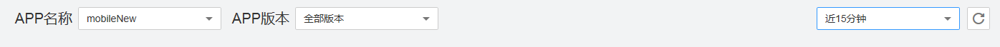
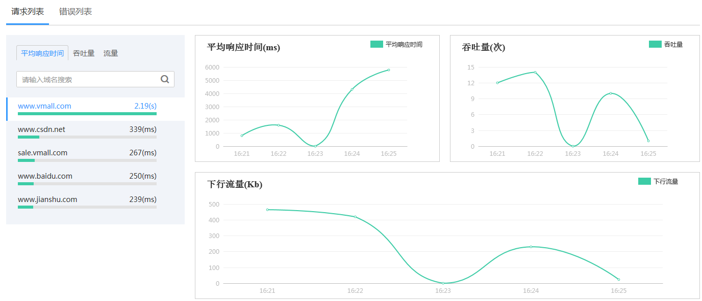
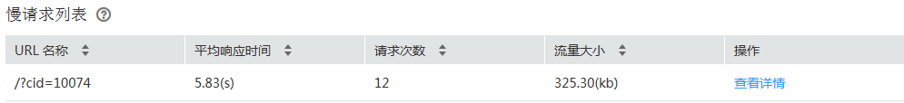

# 网络交互

APM支持统计分析APP的网络交互数据，例如网络相应时间、吞吐量、请求错误率等，您可以通过这些网络数据更好的了解APP的用户体验质量，以便于您更好的有针对性的进行网络优化，提升APP使用体验。

## 选择APP名称/版本/统计时间

进行网络交互数据统计前，您需要先选择待统计的APP及统计时间。

1.  选择“Mobile \> 网络交互”，进入“网络交互”界面。
2.  在页面最上方的下拉框中分别选择“APP名称”“APP版本”和“统计时间”。

    

## 请求数据统计

统计用户请求的平均响应时间、吞吐量、下行流量。如下示例图所示：

## 慢请求列表

请求时延大于2秒的请求我们定义为慢请求。此处统计请求次数大于5次的慢请求，提供查看详情功能，方便您分析原因优化改进。

## 错误请求统计

从域名和状态码维度统计用户请求发生错误的概率并提供错误请求列表和查看错误详情功能，方便您分析原因优化改进。

