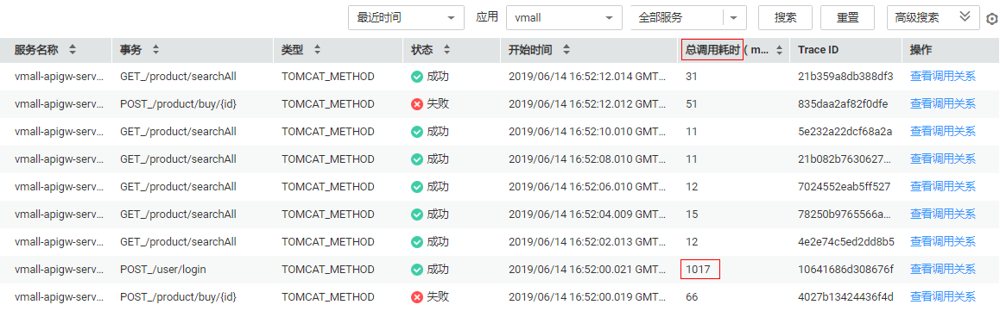
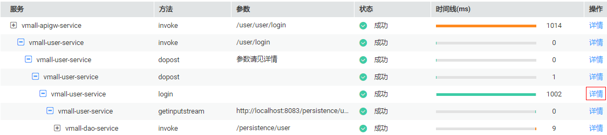
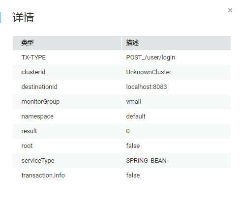
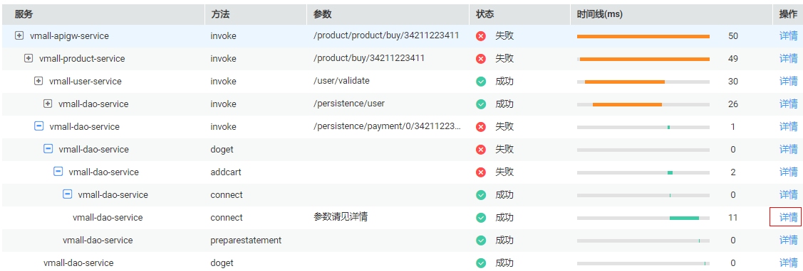
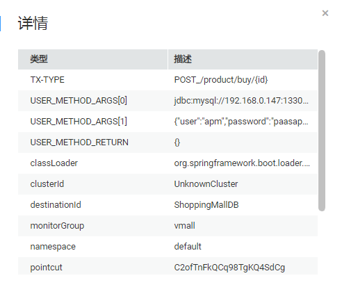

# 调用链

调用链可跟踪、记录业务的调用过程，对应用的调用状态、调用耗时等关键指标进行全方位的监控，可视化地还原业务请求在分布式系统中的执行轨迹和状态，用于性能及故障快速定界。

## 性能瓶颈定界

1.  在调用链界面右上边，分别在“最近时间”、“应用”和“全部服务”的下拉列表框中选择需要查询的时间范围、应用名称和服务名称，单击“搜索”，查询相应的调用链。
2.  （可选）在调用链界面中，单击右上角高级搜索，设置查询条件，单击“搜索”，查询相应的调用链。
3.  单击“操作”列的“查看调用关系”。
4.  根据“时间线”锁定耗时较长的方法，找出性能瓶颈。

    

5.  （可选）查看调用的辅助信息，进一步定界问题产生的原因。

    

    单击“操作”列的“详情”，查看详细的调用信息。

    

## 故障辅助定位

1.  在调用链界面右上边，分别在“最近时间”、“应用”和“全部服务”的下拉列表框中选择需要查询的时间范围、应用名称和服务名称，单击“搜索”，查询相应的调用链。
2.  （可选）在调用链界面中，单击右上角高级搜索，设置查询条件，单击“搜索”，查询相应的调用链。
3.  在“状态”列查看相应的状态是否正常，找出故障的业务。

    

4.  单击“查看调用关系”，查看返回值是否正常，找出故障。

    

5.  （可选）查看接口调用的辅助信息，进一步定界问题产生的原因。

    单击“操作”列的“详情”，查看详细的调用信息。

    

