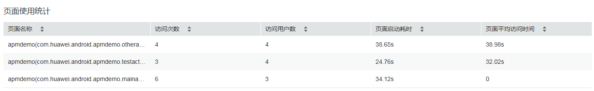
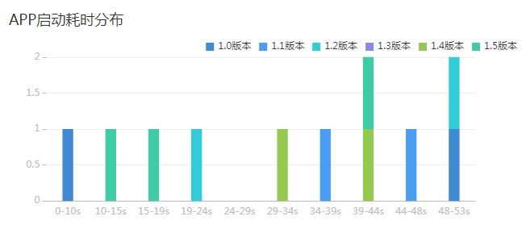
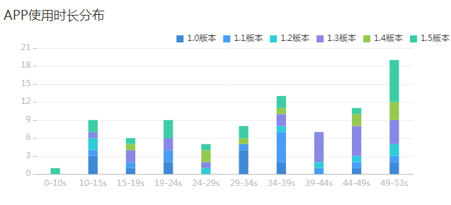
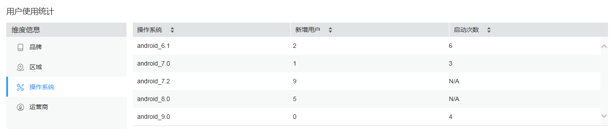

# 运营分析

APM支持统计分析APP的用户运营数据，例如访问用户数、新增用户数、访问次数等，您可以通过这些运营数据更好的了解APP的使用情况，以便于您更有针对性的开展运营活动。

## 选择APP名称/版本/统计时间

进行运营数据统计前，您需要先选择待统计的APP及统计时间。

1.  选择“Mobile \> 运营分析”，进入“运营分析”界面。
2.  在页面最上方的下拉框中分别选择“APP名称”“APP版本”和“统计时间”。

    

## 页面使用统计

统计APP每个页面的访问次数、访问用户数、页面启动耗时和页面平均访问时间。

## APP启动耗时分布

APP启动耗时直接关系着用户的使用体验，启动耗时数据能反馈出用户使用APP的体验质量。

> **说明：**   
>-   您可以在选择APP版本时选择全部版本，此时分布图上会用不同颜色来表示不同版本的数据  
>-   上图为无数据示例图。  

## APP使用时长分布

APP使用时长可体现出用户对APP的依赖程度或APP对用户的有用程度。

## 用户使用统计

从终端品牌、区域、操作系统和运营商维度统计新增用户数和APP启动次数。帮助您了解用户使用习惯、建立用户画像。

