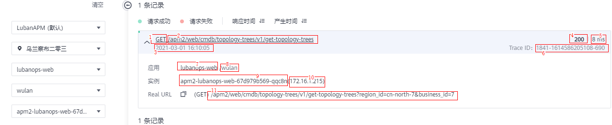

# 调用链

调用链详情展示的是整个调用过程中，部分本地方法堆栈和相关远程调用的调用关系。通过调用链跟踪，一次请求的逻辑轨迹可以被完整清晰的展示出来。

## 查看调用链

**调用链条件查询**

1.  登录APM控制台。
2.  在左侧导航栏中选择“应用监控 \> 调用链”，进入调用链界面。
3.  输入如下查询条件查询具体的调用链列表，也可在界面下方新增自定义查询条件。

    **表 1**  调用链查询条件

    
    <table><thead align="left"><tr id="row194890175546"><th class="cellrowborder" valign="top" width="22.38223822382238%" id="mcps1.2.4.1.1">
查询条件

    </th>
    <th class="cellrowborder" valign="top" width="56.81568156815682%" id="mcps1.2.4.1.2">
具体含义

    </th>
    <th class="cellrowborder" valign="top" width="20.8020802080208%" id="mcps1.2.4.1.3">
必填/选填

    </th>
    </tr>
    </thead>
    <tbody><tr id="row16489617205415"><td class="cellrowborder" valign="top" width="22.38223822382238%" headers="mcps1.2.4.1.1 ">
业务

    </td>
    <td class="cellrowborder" valign="top" width="56.81568156815682%" headers="mcps1.2.4.1.2 ">
调用链所在业务。

    </td>
    <td class="cellrowborder" valign="top" width="20.8020802080208%" headers="mcps1.2.4.1.3 ">
必填

    </td>
    </tr>
    <tr id="row64891317205419"><td class="cellrowborder" valign="top" width="22.38223822382238%" headers="mcps1.2.4.1.1 ">
区域

    </td>
    <td class="cellrowborder" valign="top" width="56.81568156815682%" headers="mcps1.2.4.1.2 ">
调用链所在区域.

    </td>
    <td class="cellrowborder" valign="top" width="20.8020802080208%" headers="mcps1.2.4.1.3 ">
必填

    </td>
    </tr>
    <tr id="row154906175543"><td class="cellrowborder" valign="top" width="22.38223822382238%" headers="mcps1.2.4.1.1 ">
应用

    </td>
    <td class="cellrowborder" valign="top" width="56.81568156815682%" headers="mcps1.2.4.1.2 ">
调用链所在应用。

    </td>
    <td class="cellrowborder" valign="top" width="20.8020802080208%" headers="mcps1.2.4.1.3 ">
选填

    </td>
    </tr>
    <tr id="row184900179542"><td class="cellrowborder" valign="top" width="22.38223822382238%" headers="mcps1.2.4.1.1 ">
环境

    </td>
    <td class="cellrowborder" valign="top" width="56.81568156815682%" headers="mcps1.2.4.1.2 ">
调用链所在环境。

    </td>
    <td class="cellrowborder" valign="top" width="20.8020802080208%" headers="mcps1.2.4.1.3 ">
选填

    </td>
    </tr>
    <tr id="row154904171547"><td class="cellrowborder" valign="top" width="22.38223822382238%" headers="mcps1.2.4.1.1 ">
实例

    </td>
    <td class="cellrowborder" valign="top" width="56.81568156815682%" headers="mcps1.2.4.1.2 ">
调用链所在实例。

    </td>
    <td class="cellrowborder" valign="top" width="20.8020802080208%" headers="mcps1.2.4.1.3 ">
选填

    </td>
    </tr>
    <tr id="row849020172540"><td class="cellrowborder" valign="top" width="22.38223822382238%" headers="mcps1.2.4.1.1 ">
URL

    </td>
    <td class="cellrowborder" valign="top" width="56.81568156815682%" headers="mcps1.2.4.1.2 ">
调用链的URL，分为Rest URL和Real URL两种搜索条件：Rest URL为restful风格的URL，URL中带有变量名称，如/apm/get/{id}；Real URL为实际访问的URL。

    </td>
    <td class="cellrowborder" valign="top" width="20.8020802080208%" headers="mcps1.2.4.1.3 ">
选填

    </td>
    </tr>
    <tr id="row95111840113316"><td class="cellrowborder" valign="top" width="22.38223822382238%" headers="mcps1.2.4.1.1 ">
精确

    </td>
    <td class="cellrowborder" valign="top" width="56.81568156815682%" headers="mcps1.2.4.1.2 ">
对URL是否精确匹配，开启状态下为精确查询URL，不开启则进行模糊查询。

    </td>
    <td class="cellrowborder" valign="top" width="20.8020802080208%" headers="mcps1.2.4.1.3 ">
选填

    </td>
    </tr>
    <tr id="row1449012178547"><td class="cellrowborder" valign="top" width="22.38223822382238%" headers="mcps1.2.4.1.1 ">
调用方法

    </td>
    <td class="cellrowborder" valign="top" width="56.81568156815682%" headers="mcps1.2.4.1.2 ">
调用链的HttpMethod.

    </td>
    <td class="cellrowborder" valign="top" width="20.8020802080208%" headers="mcps1.2.4.1.3 ">
选填

    </td>
    </tr>
    <tr id="row1349071755410"><td class="cellrowborder" valign="top" width="22.38223822382238%" headers="mcps1.2.4.1.1 ">
状态码

    </td>
    <td class="cellrowborder" valign="top" width="56.81568156815682%" headers="mcps1.2.4.1.2 ">
调用链返回的HTTP状态码。

    </td>
    <td class="cellrowborder" valign="top" width="20.8020802080208%" headers="mcps1.2.4.1.3 ">
选填

    </td>
    </tr>
    <tr id="row1490917155414"><td class="cellrowborder" valign="top" width="22.38223822382238%" headers="mcps1.2.4.1.1 ">
Content

    </td>
    <td class="cellrowborder" valign="top" width="56.81568156815682%" headers="mcps1.2.4.1.2 ">
调用链内容搜索，可以根据调用链的参数等信息进行调用链搜索.

    </td>
    <td class="cellrowborder" valign="top" width="20.8020802080208%" headers="mcps1.2.4.1.3 ">
选填

    </td>
    </tr>
    <tr id="row10490141715540"><td class="cellrowborder" valign="top" width="22.38223822382238%" headers="mcps1.2.4.1.1 ">
响应时间

    </td>
    <td class="cellrowborder" valign="top" width="56.81568156815682%" headers="mcps1.2.4.1.2 ">
调用链的响应时间范围，可以填写最小响应时间和最大响应时间搜索调用链，两个值都可以为空。

    </td>
    <td class="cellrowborder" valign="top" width="20.8020802080208%" headers="mcps1.2.4.1.3 ">
选填

    </td>
    </tr>
    <tr id="row2491141765419"><td class="cellrowborder" valign="top" width="22.38223822382238%" headers="mcps1.2.4.1.1 ">
是否异常

    </td>
    <td class="cellrowborder" valign="top" width="56.81568156815682%" headers="mcps1.2.4.1.2 ">
调用链是否有异常。

    </td>
    <td class="cellrowborder" valign="top" width="20.8020802080208%" headers="mcps1.2.4.1.3 ">
选填

    </td>
    </tr>
    <tr id="row1549171710545"><td class="cellrowborder" valign="top" width="22.38223822382238%" headers="mcps1.2.4.1.1 ">
Trace ID

    </td>
    <td class="cellrowborder" valign="top" width="56.81568156815682%" headers="mcps1.2.4.1.2 ">
调用链的TraceID，填写该搜索条件后，其他搜索条件全部失效，只根据该TraceID搜索。

    </td>
    <td class="cellrowborder" valign="top" width="20.8020802080208%" headers="mcps1.2.4.1.3 ">
选填

    </td>
    </tr>
    </tbody>
    </table>

**根据搜索条件查询出来的调用链列表可以查看调用链的基本信息**

在查询后的调用链列表中，单击待查看的调用链前的，查看该调用链基本信息，如下图所示。

**图 1**  调用链基本信息  

表中标识的具体参数所代表的含义如下：

1.  调用链的HttpMethod
2.  调用链的RestURL，Rest URL为restful风格的URL，URL中带有变量名称，如/apm/get/\{id\}；点击该URL可以跳转到调用链的详情页面
3.  调用链的开始时间
4.  调用链返回的HTTP状态码
5.  调用链的响应时间
6.  调用链的TraceID
7.  调用链所在应用
8.  调用链所在环境
9.  调用链所在实例的主机名
10. 调用链所在实例的IP
11. 调用链的实际URL

**调用链详情页面可以查看调用链的完整链路信息，包含本地方法堆栈和相关远程调用的调用关系**

单击调用链名称，可查看调用链详细信息，如下图所示。

-   上半部分为调用链完整链路的时序图，展示应用之间的完整调用关系。
-   下半部分为调用链详细的方法堆栈，每一行代表一个方法调用，展示了调用链内部方法的详细调用关系。默认只展示javaagent支持的组件方法，如需展示业务方法，可以在JavaMethod配置中配置需要拦截的业务方法。

    **图 2**  调用关系  
    

    表中标识的具体参数所代表的含义如下：

1.  调用链的时序图中调用接口所属的应用和环境。
2.  数字为接口调用的客户端响应时间，单位ms，具可将鼠标指针放置在该位置进行查看。
3.  数字为接口调用的服务端响应时间，单位ms。
4.  调用链方法堆栈中该方法对应的关键参数数据，如tomcat入口方法展示实际url、mysql的sql调用方法则展示具体执行sql。
5.  调用链方法的扩展数据，一般展示该方法相关的参数信息。

